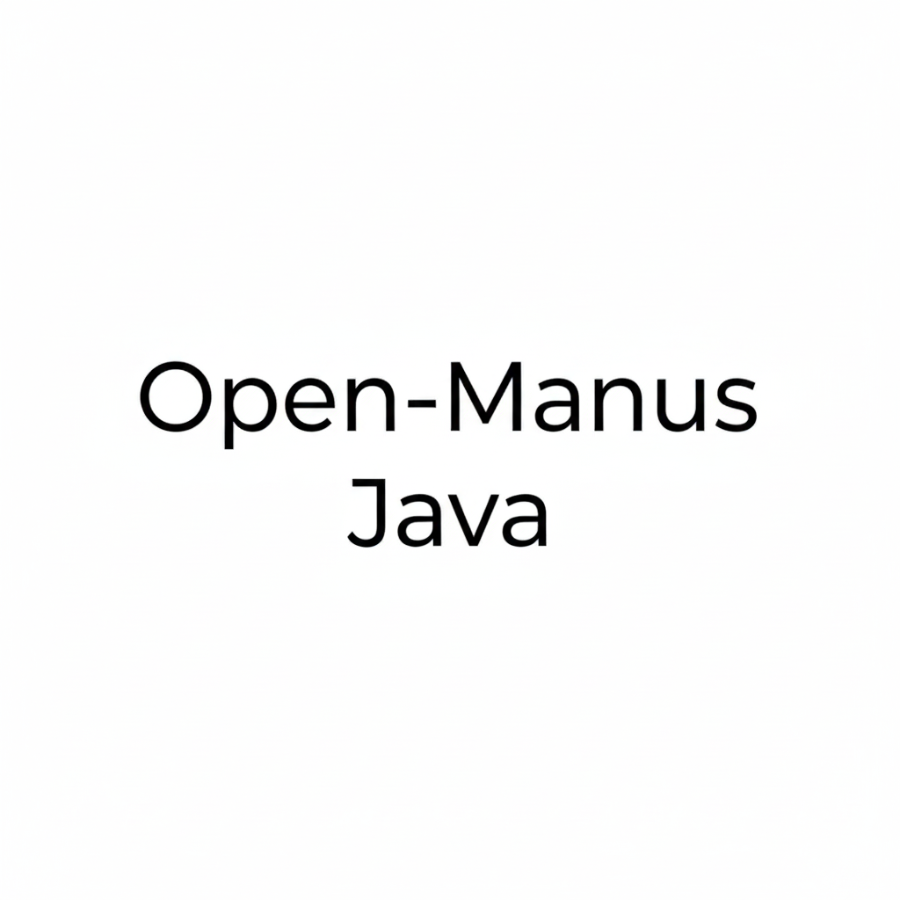
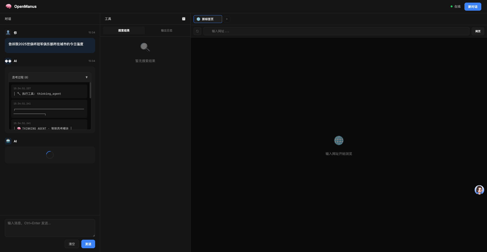
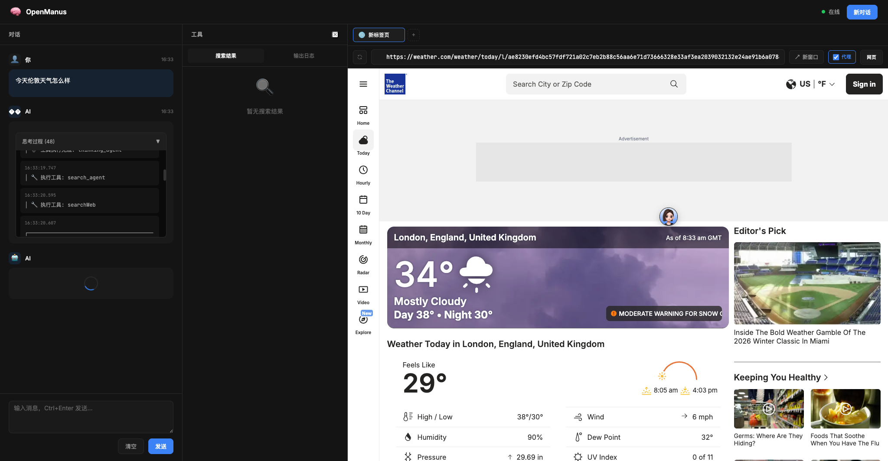
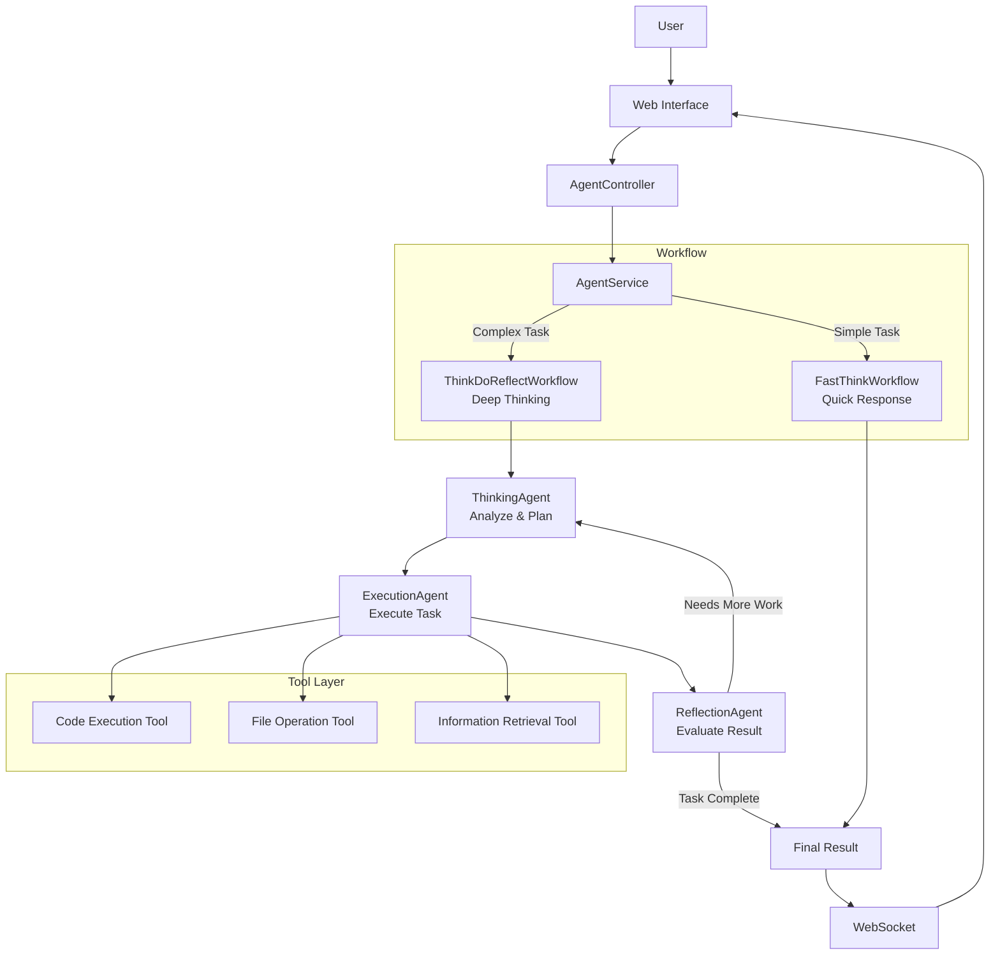

# OpenManusJava

<div align="center">



**An Intelligent Thinking System Based on Java - A Multi-modal Agent Framework with Fast/Slow Thinking**

[](https://openjdk.java.net/projects/jdk/21/)
[](https://spring.io/projects/spring-boot)
[](https://github.com/langchain4j/langchain4j)
[](LICENSE)

[🚀 Quick Start](#-quick-start) •
[🎯 Features](#-features) •
[🏗️ Architecture](#️-architecture) •

</div>

## 📋 Project Overview

OpenManusJava is an intelligent thinking system developed based on Spring Boot and LangChain4j. It adopts a "fast thinking/slow thinking" dual-mode architecture, combining the efficiency of direct output with the depth of a think-execute-reflect loop. The system can automatically or manually select the most appropriate thinking mode according to task complexity, significantly improving the processing quality of complex tasks.

### 🎯 Features

#### 🧠 Multi-modal Intelligent Thinking
- **Fast Thinking Mode**: Direct execution for high efficiency, suitable for simple tasks.
- **Slow Thinking Mode**: Think-execute-reflect loop, suitable for complex tasks.
- **Automatic Mode**: Intelligently selects the thinking mode based on task complexity.

#### 💭 Intelligent Agent System
- **FastThinkWorkflow**: A workflow for quick responses.
- **ThinkDoReflectWorkflow**: A workflow for cyclic reflection.
- **Multiple Specialized Agents**: Specialized agents for thinking, execution, reflection, etc.

#### 🔧 Tool Ecosystem
- **Code Execution**: Executes code and analyzes the results.
- **File Operations**: Manages files and content.
- **Web Access**: Intelligently retrieves information.

#### 🎨 User Interface
- **Modern 3-Column Workspace**:
  - **Left**: An intelligent chat panel for core human-computer interaction.
  - **Middle**: A versatile tool panel displaying structured search results, tool outputs, and files.
  - **Right**: A browser workspace with multi-tab support, address bar navigation, and dual-mode (Web/VNC) capabilities.
- **Real-time Thinking Process**: Visualizes the AI's thinking steps and logs.
- **Responsive Design**: Adapts to desktop, tablet, and mobile devices.

#### 🖼️ UI Preview





> Note: Some websites block being embedded in an iframe via security headers like `X-Frame-Options` or CSP `frame-ancestors`.
> If you see “此网站无法在此预览”, enable the **“代理”** toggle in the address bar to load the page through the backend proxy.

## 🏗️ Architecture

### Core Architecture Diagram



### Technology Stack

| **Component** | **Technology** | **Purpose** |
|----------|-------------|---------|
| **Backend Framework** | Spring Boot 3.2.0 | Core application framework |
| **AI Integration** | LangChain4j 1.1.0 | LLM integration and multi-agent collaboration |
| **Frontend** | Vue.js 3 + Element Plus | Modern, responsive user interface |
| **Real-time Comms** | WebSocket + STOMP | Real-time messaging and log streaming |
| **API** | RESTful API | Service interface |
| **Documentation** | Markdown | Project documentation |

## 🚀 Quick Start

### Prerequisites

- **Java 21+**
- **Maven 3.9+**
- **Alibaba Cloud Bailian API Key** (or other supported LLM service)

### Installation

1. **Clone the project**
   ```bash
   git clone https://github.com/OpenManus/OpenManus-Java.git
   cd OpenManus-Java
   ```

2. **Configure API keys (recommended)**
   Copy `dotenv.example` to `.env` and fill in your API keys:
   ```bash
   cp dotenv.example .env
   ```

3. **Optional: override application config**
   Use `src/main/resources/application-example.yml` as a reference, and create `src/main/resources/application-local.yml` for personal overrides.

4. **Start the application**
   ```bash
   mvn spring-boot:run
   ```
   If you created `application-local.yml`, run with the local profile:
   ```bash
   mvn spring-boot:run -Dspring-boot.run.profiles=local
   ```

5. **Access the service**
   Open your browser and go to: http://localhost:8089

For a one-command setup (Docker Compose), see: `docs/QUICK_START.md`.

## 📊 Usage

### Unified API Endpoint

All interactions are handled through a unified streaming API, `think-do-reflect-stream`, which automatically processes and returns real-time progress.

```bash
# Example Request
curl -X POST http://localhost:8089/api/agent/think-do-reflect-stream \
  -H "Content-Type: application/json" \
  -d '{"input": "Analyze the development trend of the tourism industry during the Spring Festival."}'
```

### API Documentation

Swagger UI: http://localhost:8089/swagger-ui.html

## 📬 Contact Me

- WeChat: leochame007
- Email: liulch.cn@gmail.com


## 🙏 Acknowledgements

Thanks to the following open-source projects for their support:
- [LangChain4j](https://github.com/langchain4j/langchain4j)
- [Spring Boot](https://spring.io/projects/spring-boot)

## 📄 License

This project is licensed under the [MIT License](LICENSE).

---

<div align="center">

**🌟 If this project is helpful to you, please give it a Star!**

</div> 