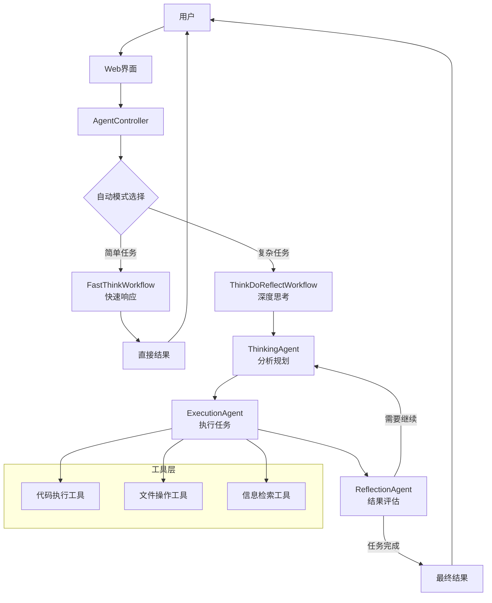

# OpenManus Java

<div align="center">


**基于 Java 的智能思考系统 - 快思考/慢思考多模式智能体框架**

[](https://openjdk.java.net/projects/jdk/21/)
[](https://spring.io/projects/spring-boot)
[](https://github.com/langchain4j/langchain4j)
[](LICENSE)

[🚀 快速开始](#-快速开始) •
[🎯 功能特性](#-功能特性) •
[🏗️ 架构设计](#️-架构设计) •
[📚 文档](#-文档)

</div>

## 📋 项目概述

OpenManus Java 是一个基于 Spring Boot 和 LangChain4j 开发的智能思考系统，它采用"快思考/慢思考"双模式架构，结合了直接输出的效率与思考-执行-反思循环的深度。该系统能够根据任务复杂度自动或手动选择最合适的思考模式，大幅提升复杂任务的处理质量。

### 🎯 功能特性

#### 🧠 多模式智能思考
- **快思考模式**: 直接执行，高效响应，适合简单任务
- **慢思考模式**: 思考-执行-反思循环，适合复杂任务
- **自动模式**: 根据任务复杂度智能选择思考模式

#### 💭 智能Agent系统
- **FastThinkWorkflow**: 快速响应工作流
- **ThinkDoReflectWorkflow**: 循环反思工作流
- **多种专业Agent**: 思考、执行、反思等专业智能体

#### 🔧 工具生态
- **代码执行能力**: 执行代码并分析结果
- **文件操作工具**: 管理文件和内容
- **网络访问能力**: 智能检索信息

#### 🎨 用户界面
- **现代化Web界面**: 响应式设计，简洁易用
- **模式选择器**: 可视化选择思考模式
- **实时思考指示**: 直观展示处理进度
- **调试面板**: 快速排查问题

## 🏗️ 架构设计

### 核心架构图



### 技术栈

| **组件** | **技术选型** | **用途** |
|----------|-------------|---------|
| **后端框架** | Spring Boot 3.2.0 | 应用核心框架 |
| **AI集成** | LangChain4j 1.1.0 | LLM对接与工具集成 |
| **前端** | Vue.js 3 + Element Plus | 用户界面 |
| **API** | RESTful API | 服务接口 |
| **文档** | Markdown | 项目文档 |

## 🚀 快速开始

### 环境要求

- **Java 21+**
- **Maven 3.9+**
- **阿里云百炼API Key** (或其他支持的LLM服务)

### 安装步骤

1. **克隆项目**
```bash
git clone https://github.com/OpenManus/OpenManus-Java.git
cd OpenManus-Java
```

2. **配置环境**
创建`application.yml`文件并配置LLM服务:
```yaml
openmanus:
  llm:
    provider: dashscope  # 阿里云百炼
    api-key: ${YOUR_API_KEY}
    model-name: qwen-max  # 或其他支持的模型
```

3. **启动应用**
```bash
./mvnw spring-boot:run
```

4. **访问服务**
浏览器访问: http://localhost:8089

## 📊 使用方式

### 思考模式选择

- **快思考模式**: 直接响应，适合简单查询和任务
- **慢思考模式**: 深度思考，适合复杂问题解决和规划
- **自动模式**: 系统根据任务复杂度自动选择最佳模式

### API使用

```bash
# 快思考模式
curl -X POST http://localhost:8089/api/agent/chat \
  -H "Content-Type: application/json" \
  -d '{"message": "今天的天气如何？"}'

# 慢思考模式  
curl -X POST http://localhost:8089/api/agent/think-do-reflect \
  -H "Content-Type: application/json" \
  -d '{"input": "分析一下春节期间旅游行业的发展趋势"}'
  
# 自动模式
curl -X POST http://localhost:8089/api/agent/auto \
  -H "Content-Type: application/json" \
  -d '{"input": "帮我写一个Java函数计算斐波那契数列"}'
```


## 🙏 致谢

感谢以下开源项目的支持：
- [LangChain4j](https://github.com/langchain4j/langchain4j)
- [Spring Boot](https://spring.io/projects/spring-boot)

## 📄 许可证

本项目采用 [MIT 许可证](LICENSE)。

---

<div align="center">

**🌟 如果这个项目对您有帮助，欢迎Star支持！**

</div>