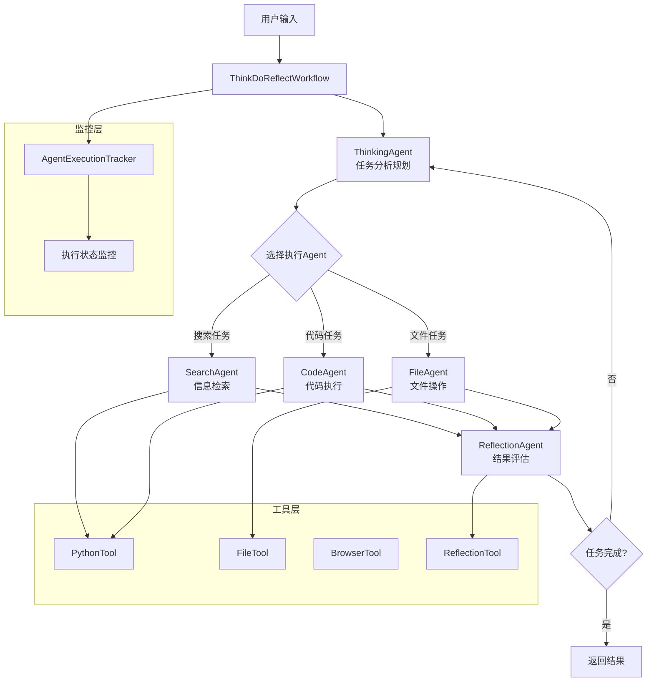

# OpenManus Java

<div align="center">


**基于 LangChain4j AgentExecutor 和 AgentHandoff 机制的智能 AI Agent 系统**

[](https://openjdk.java.net/projects/jdk/21/)
[](https://spring.io/projects/spring-boot)
[](https://github.com/bsorrentino/langgraph4j)
[](https://github.com/langchain4j/langchain4j)

[🚀 快速开始](#-快速开始) •
[📚 文档](#-文档) •
[🎯 功能特性](#-功能特性) •
[🏗️ 架构设计](#️-架构设计) •
[🤝 贡献指南](#-贡献指南)

</div>

## 📋 项目概述

OpenManus Java 是一个基于 **LangChain4j AgentExecutor 和 AgentHandoff 机制** 的智能代理系统，专为构建复杂的AI工作流而设计。通过 Think-Do-Reflect 循环反思模式、多Agent协作和智能监控系统，为开发者提供强大而灵活的AI应用开发平台。

### 🎯 功能特性

#### 🧠 Think-Do-Reflect 核心架构
- **循环反思工作流**: 基于 AgentHandoff 的智能Agent协作
- **Think-Do-Reflect 模式**: Think → Do → Reflect 完整循环
- **智能Agent调度**: 根据任务需求动态选择合适的Agent
- **执行监控机制**: 实时追踪Agent执行状态和工具调用

#### 💭 智能Agent系统
- **ThinkingAgent**: 深度问题分析和执行规划
- **SearchAgent**: 网络搜索和信息检索
- **CodeAgent**: Python代码执行和数据分析
- **FileAgent**: 文件操作和内容处理
- **ReflectionAgent**: 结果评估和循环决策

#### 🔧 强大的工具生态
- **代码执行**: Python 代码安全执行环境
- **文件操作**: 完整的文件系统操作能力
- **网络访问**: 智能网页浏览和信息提取
- **记忆管理**: 向量数据库支持的长期记忆

#### 🎨 监控和调试
- **Agent执行监控**: 实时追踪Agent状态和工具调用
- **Think-Do-Reflect界面**: 可视化循环反思工作流
- **执行历史记录**: 完整的Agent执行轨迹
- **多Agent协作演示**: 模拟复杂的多Agent协作场景

## 🏗️ 架构设计

### 核心架构图



### 技术栈对比

| **组件** | **传统架构** | **Think-Do-Reflect架构** |
|----------|-------------|------------------------|
| **核心框架** | AI Services | AgentExecutor + AgentHandoff |
| **推理模式** | 单轮对话 | 多轮循环反思 |
| **Agent协作** | 单一Agent | 多Agent智能调度 |
| **监控系统** | 无 | 实时执行监控 |
| **反思机制** | 无 | 循环评估改进 |
| **错误处理** | 基础异常 | 智能重试机制 |

## 🚀 快速开始

### 环境要求

- **Java 21+** (LTS 推荐)
- **Maven 3.9+**
- **Docker** (可选，用于沙箱执行)
- **阿里云百炼 API Key**

### 安装步骤

1. **克隆项目**
```bash
git clone https://github.com/OpenManus/OpenManus-Java.git
cd OpenManus-Java
```

2. **配置环境**
```bash
cp env.example .env
# 编辑 .env 文件，填入你的 API Key
```

3. **启动应用**
```bash
mvn spring-boot:run
```

4. **访问服务**
- **主界面**: http://localhost:8089
- **Think-Do-Reflect**: http://localhost:8089/think-do-reflect.html
- **Agent监控**: http://localhost:8089/agent-execution-monitor.html
- **API 文档**: http://localhost:8089/swagger-ui.html

### 快速体验

```bash
# 发送测试请求
curl -X POST http://localhost:8089/api/agent/chat \
  -H "Content-Type: application/json" \
  -d '{
    "message": "帮我分析一下当前目录的文件结构",
    "sessionId": "test-session"
  }'
```

## 📚 核心组件详解

### 1. ThinkDoReflectWorkflow

核心工作流管理器，协调各个Agent的执行：

```java
@Service
public class ThinkDoReflectWorkflow {
    private final CompiledGraph<AgentExecutor.State> handoffExecutor;
    
    // Think-Do-Reflect循环执行
    public CompletableFuture<String> execute(String userInput);
    
    // 同步执行版本
    public String executeSync(String userInput);
}
```

### 2. Agent执行系统

#### ThinkingAgent - 智能规划
```java
public class ThinkingAgent extends AbstractAgentExecutor<ThinkingAgent.Builder> {
    // 任务分析和规划
    // 执行步骤制定
    // 策略调整
}
```

#### SearchAgent - 信息检索
```java
public class SearchAgent extends AbstractAgentExecutor<SearchAgent.Builder> {
    // 网络搜索
    // 信息提取
    // 内容整理
}
```

#### ReflectionAgent - 结果评估
```java
public class ReflectionAgent extends AbstractAgentExecutor<ReflectionAgent.Builder> {
    // 结果分析
    // 完成度评估
    // 循环决策
}
```

### 3. 监控系统

#### Agent执行追踪
- **实时监控**: AgentExecutionTracker 追踪执行状态
- **历史记录**: 完整的Agent执行轨迹
- **性能分析**: 工具调用统计和性能指标

```java
@Component
public class AgentExecutionTracker {
    // Agent执行状态追踪
    public void startAgentExecution(String sessionId, String agentId, String agentName, Map<String, Object> context);
    
    // 工具调用记录
    public void recordToolCall(String sessionId, String agentId, String toolName, String input, String output);
    
    // 执行结束记录
    public void endAgentExecution(String sessionId, String agentId, String agentName, String result, ExecutionStatus status);
}
```

## 🎨 监控和调试

### Agent执行监控

启动应用后访问相关界面进行监控和调试：

- **执行监控**: http://localhost:8089/agent-execution-monitor.html - 实时查看Agent执行状态
- **Think-Do-Reflect**: http://localhost:8089/think-do-reflect.html - 体验循环反思工作流
- **多Agent演示**: http://localhost:8089/agent-monitor-demo.html - 模拟多Agent协作
- **主界面**: http://localhost:8089 - 智能对话系统

### 监控功能

```java
// Agent执行追踪
AgentExecutionTracker tracker;

// 开始监控Agent执行
tracker.startAgentExecution(sessionId, agentId, agentName, context);

// 记录工具调用
tracker.recordToolCall(sessionId, agentId, toolName, input, output);

// 结束执行监控
tracker.endAgentExecution(sessionId, agentId, agentName, result, status);
```

## 🔧 配置说明

### 主要配置文件

```yaml
# application.yml
openmanus:
  llm:
    model: "qwen-max"
    base-url: "https://dashscope.aliyuncs.com/compatible-mode/v1/"
    api-key: "${OPENMANUS_LLM_API_KEY}"
    
  sandbox:
    use-sandbox: true
    memory-limit: "512m"
    timeout: 120
    
  memory:
    max-messages: 100
    vector-store: "in-memory"
```

### 环境变量

```bash
# 必需配置 - 请在application.yml中配置API密钥
# 或通过环境变量设置
OPENMANUS_LLM_API_KEY=your-api-key-here

# 可选配置
OPENMANUS_LLM_MODEL=qwen-max
OPENMANUS_SANDBOX_ENABLED=false
OPENMANUS_MONITOR_ENABLED=true
```

## 🚀 进阶使用

### 自定义Agent

```java
public class CustomAgent extends AbstractAgentExecutor<CustomAgent.Builder> {
    public static class Builder extends AbstractAgentExecutor.Builder<Builder> {
        public CustomAgent build() throws GraphStateException {
            this.name("custom_agent")
                .description("自定义Agent描述")
                .systemMessage(SystemMessage.from("自定义系统提示"));
            return new CustomAgent(this);
        }
    }
    
    @Override
    public String execute(ToolExecutionRequest request, Object context) {
        // 自定义执行逻辑
        return "处理结果";
    }
}
```

### 扩展工具

```java
@Component
public class CustomTool {
    @Tool("自定义工具描述")
    public String customOperation(String input) {
        // 工具实现
        return "result";
    }
}
```

### 监控配置定制

```java
@Configuration
public class MonitorConfig {
    @Bean
    public AgentExecutionTracker agentExecutionTracker() {
        return new AgentExecutionTracker(
            maxHistorySize: 1000,
            enableRealTimeMonitoring: true,
            retentionPeriod: Duration.ofHours(24)
        );
    }
}
```

## 📊 性能与监控

### 内置监控

- **Spring Boot Actuator**: `/actuator/health`
- **Prometheus 指标**: `/actuator/prometheus`
- **JVM 监控**: 内存、线程、GC 状态

### 性能优化

- **异步执行**: Agent支持异步处理和并发执行
- **连接池**: HTTP连接复用和资源管理
- **监控优化**: 轻量级执行状态追踪
- **内存管理**: 智能的执行历史清理机制

## 🔒 安全特性

- **沙箱隔离**: Docker容器隔离代码执行
- **输入验证**: 严格的参数校验和清理
- **API限流**: 防止恶意调用
- **敏感信息**: 环境变量管理密钥

## 📚 文档

- [开发文档](docs/DEVELOPMENT.md)
- [架构设计](docs/ARCHITECTURE.md)
- [部署指南](docs/DEPLOYMENT_GUIDE.md)
- [API参考](docs/API_REFERENCE.md)

## 🤝 贡献指南

欢迎参与 OpenManus 的开发！

1. Fork 本仓库
2. 创建特性分支 (`git checkout -b feature/amazing-feature`)
3. 提交变更 (`git commit -m 'Add amazing feature'`)
4. 推送到分支 (`git push origin feature/amazing-feature`)
5. 创建 Pull Request

## 📄 许可证

本项目采用 [MIT 许可证](LICENSE)。

## 🙏 致谢

感谢以下开源项目：

- [LangGraph4j](https://github.com/bsorrentino/langgraph4j) - StateGraph 架构
- [LangChain4j](https://github.com/langchain4j/langchain4j) - LLM 集成
- [Spring Boot](https://spring.io/projects/spring-boot) - 应用框架

---

<div align="center">

**🌟 如果这个项目对您有帮助，请给我们一个 Star！**

[GitHub](https://github.com/OpenManus/OpenManus-Java) •
[文档](https://docs.openmanus.io) •
[社区](https://discord.gg/openmanus)

</div>