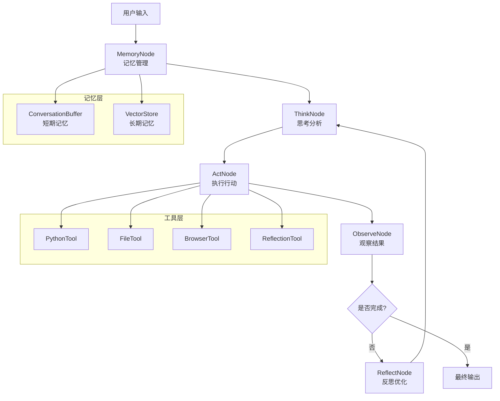

# OpenManus Java

<div align="center">


**基于 LangGraph4j StateGraph 架构的智能 AI Agent 系统**

[](https://openjdk.java.net/projects/jdk/21/)
[](https://spring.io/projects/spring-boot)
[](https://github.com/bsorrentino/langgraph4j)
[](https://github.com/langchain4j/langchain4j)

[🚀 快速开始](#-快速开始) •
[📚 文档](#-文档) •
[🎯 功能特性](#-功能特性) •
[🏗️ 架构设计](#️-架构设计) •
[🤝 贡献指南](#-贡献指南)

</div>

## 📋 项目概述

OpenManus Java 是一个基于 **LangGraph4j StateGraph 架构** 的先进智能代理系统，专为构建复杂的AI工作流而设计。通过结合 ReAct 推理框架、智能记忆系统和可视化调试工具，为开发者提供强大而灵活的AI应用开发平台。

### 🎯 功能特性

#### 🧠 StateGraph 核心架构
- **状态图工作流**: 基于 LangGraph4j 的可视化状态管理
- **ReAct 推理循环**: Think → Act → Observe → Reflect 完整流程
- **条件路由**: 智能的状态转换和流程控制
- **检查点机制**: 支持工作流暂停、恢复和回放

#### 💭 智能推理系统
- **ThinkNode**: 深度问题分析和行动规划
- **ActNode**: 多工具并发执行和智能调度
- **ObserveNode**: 结果分析和进展评估
- **MemoryNode**: 短期和长期记忆管理

#### 🔧 强大的工具生态
- **代码执行**: Python 代码安全执行环境
- **文件操作**: 完整的文件系统操作能力
- **网络访问**: 智能网页浏览和信息提取
- **记忆管理**: 向量数据库支持的长期记忆

#### 🎨 可视化调试
- **LangGraph4j Studio**: 实时工作流可视化
- **状态监控**: 节点执行状态实时追踪
- **图表生成**: Mermaid/PlantUML 流程图导出
- **断点调试**: 支持工作流断点和单步执行

## 🏗️ 架构设计

### 核心架构图



### 技术栈对比

| **组件** | **之前架构** | **新架构 (StateGraph)** |
|----------|-------------|------------------------|
| **核心框架** | AI Services | LangGraph4j StateGraph |
| **推理模式** | 单轮对话 | 多轮 ReAct 循环 |
| **状态管理** | 无状态 | 完整状态追踪 |
| **可视化** | 无 | Studio 实时调试 |
| **记忆系统** | 简单缓存 | 双层记忆架构 |
| **错误处理** | 基础异常 | 状态恢复机制 |

## 🚀 快速开始

### 环境要求

- **Java 21+** (LTS 推荐)
- **Maven 3.9+**
- **Docker** (可选，用于沙箱执行)
- **阿里云百炼 API Key**

### 安装步骤

1. **克隆项目**
```bash
git clone https://github.com/OpenManus/OpenManus-Java.git
cd OpenManus-Java
```

2. **配置环境**
```bash
cp env.example .env
# 编辑 .env 文件，填入你的 API Key
```

3. **启动应用**
```bash
mvn spring-boot:run
```

4. **访问服务**
- **Web 界面**: http://localhost:8089
- **Studio 调试**: http://localhost:8089/ (自动重定向到 Studio)
- **API 文档**: http://localhost:8089/swagger-ui.html

### 快速体验

```bash
# 发送测试请求
curl -X POST http://localhost:8089/api/agent/chat \
  -H "Content-Type: application/json" \
  -d '{
    "message": "帮我分析一下当前目录的文件结构",
    "sessionId": "test-session"
  }'
```

## 📚 核心组件详解

### 1. OpenManusAgentState

扩展 LangGraph4j 的 AgentState，管理完整的推理状态：

```java
public class OpenManusAgentState extends AgentState {
    // ReAct 推理步骤跟踪
    private List<Map<String, Object>> reasoningSteps;
    
    // 工具调用历史
    private List<Map<String, Object>> toolCalls;
    
    // 记忆和反思信息
    private List<Map<String, Object>> reflections;
    
    // 迭代控制和元数据
    private int iterationCount;
    private int maxIterations;
}
```

### 2. React 节点系统

#### ThinkNode - 智能思考
```java
@Component
public class ThinkNode implements AsyncNodeAction<OpenManusAgentState> {
    // 深度问题分析
    // 制定行动计划
    // 决策下一步骤
}
```

#### ActNode - 执行行动
```java
@Component 
public class ActNode implements AsyncNodeAction<OpenManusAgentState> {
    // 解析行动指令
    // 调用相应工具
    // 处理执行结果
}
```

#### ObserveNode - 结果观察
```java
@Component
public class ObserveNode implements AsyncNodeAction<OpenManusAgentState> {
    // 分析执行结果
    // 评估任务进展
    // 决定继续或结束
}
```

### 3. 记忆系统

#### 双层记忆架构
- **短期记忆**: ConversationBuffer 管理对话上下文
- **长期记忆**: 向量数据库存储重要信息

```java
@Component
public class MemoryNode implements AsyncNodeAction<OpenManusAgentState> {
    // 自动重要信息识别
    // 语义相似度检索
    // 记忆分类和标签
}
```

## 🎨 可视化调试

### LangGraph4j Studio

启动应用后访问 http://localhost:8089 即可使用 Studio 进行可视化调试：

- **实时流程图**: 查看 StateGraph 执行流程
- **状态监控**: 实时查看每个节点的状态变化
- **断点调试**: 在关键节点设置断点
- **状态编辑**: 手动编辑状态数据并继续执行

### 流程图生成

```java
// 生成 Mermaid 图表
var mermaidGraph = workflow.getGraph(
    GraphRepresentation.Type.MERMAID, 
    "OpenManus Agent", 
    false
);

// 生成 PlantUML 图表  
var plantUMLGraph = workflow.getGraph(
    GraphRepresentation.Type.PLANTUML,
    "OpenManus Agent",
    false
);
```

## 🔧 配置说明

### 主要配置文件

```yaml
# application.yml
openmanus:
  llm:
    model: "qwen-max"
    base-url: "https://dashscope.aliyuncs.com/compatible-mode/v1/"
    api-key: "${OPENMANUS_LLM_API_KEY}"
    
  sandbox:
    use-sandbox: true
    memory-limit: "512m"
    timeout: 120
    
  memory:
    max-messages: 100
    vector-store: "in-memory"
```

### 环境变量

```bash
# 必需配置
OPENMANUS_LLM_API_KEY=your-api-key-here

# 可选配置
OPENMANUS_LLM_MODEL=qwen-max
OPENMANUS_SANDBOX_ENABLED=true
OPENMANUS_STUDIO_ENABLED=true
```

## 🚀 进阶使用

### 自定义节点

```java
@Component
public class CustomNode implements AsyncNodeAction<OpenManusAgentState> {
    @Override
    public CompletableFuture<Map<String, Object>> apply(OpenManusAgentState state) {
        return CompletableFuture.supplyAsync(() -> {
            // 自定义逻辑
            return Map.of("custom_result", "processed");
        });
    }
}
```

### 扩展工具

```java
@Component
public class CustomTool {
    @Tool("自定义工具描述")
    public String customOperation(String input) {
        // 工具实现
        return "result";
    }
}
```

### 记忆策略定制

```java
@Configuration
public class MemoryConfig {
    @Bean
    public ConversationBuffer conversationBuffer() {
        return new ConversationBuffer(
            maxMessages: 50,
            maxTokens: 4000,
            compressionThreshold: 30
        );
    }
}
```

## 📊 性能与监控

### 内置监控

- **Spring Boot Actuator**: `/actuator/health`
- **Prometheus 指标**: `/actuator/prometheus`
- **JVM 监控**: 内存、线程、GC 状态

### 性能优化

- **异步执行**: 所有节点支持异步处理
- **连接池**: 数据库和HTTP连接复用
- **缓存策略**: 智能记忆缓存机制
- **资源限制**: Docker沙箱资源控制

## 🔒 安全特性

- **沙箱隔离**: Docker容器隔离代码执行
- **输入验证**: 严格的参数校验和清理
- **API限流**: 防止恶意调用
- **敏感信息**: 环境变量管理密钥

## 📚 文档

- [开发文档](docs/DEVELOPMENT.md)
- [架构设计](docs/ARCHITECTURE.md)
- [部署指南](docs/DEPLOYMENT_GUIDE.md)
- [API参考](docs/API_REFERENCE.md)

## 🤝 贡献指南

欢迎参与 OpenManus 的开发！

1. Fork 本仓库
2. 创建特性分支 (`git checkout -b feature/amazing-feature`)
3. 提交变更 (`git commit -m 'Add amazing feature'`)
4. 推送到分支 (`git push origin feature/amazing-feature`)
5. 创建 Pull Request

## 📄 许可证

本项目采用 [MIT 许可证](LICENSE)。

## 🙏 致谢

感谢以下开源项目：

- [LangGraph4j](https://github.com/bsorrentino/langgraph4j) - StateGraph 架构
- [LangChain4j](https://github.com/langchain4j/langchain4j) - LLM 集成
- [Spring Boot](https://spring.io/projects/spring-boot) - 应用框架

---

<div align="center">

**🌟 如果这个项目对您有帮助，请给我们一个 Star！**

[GitHub](https://github.com/OpenManus/OpenManus-Java) •
[文档](https://docs.openmanus.io) •
[社区](https://discord.gg/openmanus)

</div>