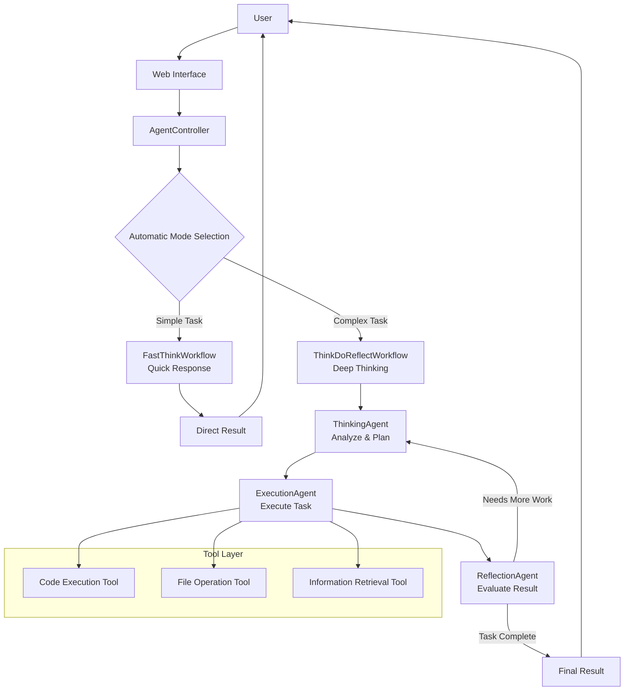

# OpenManusJava

<div align="center">


**An Intelligent Thinking System Based on Java - A Multi-modal Agent Framework with Fast/Slow Thinking**

[](https://openjdk.java.net/projects/jdk/21/)
[](https://spring.io/projects/spring-boot)
[](https://github.com/langchain4j/langchain4j)
[](LICENSE)

[🚀 Quick Start](#-quick-start) •
[🎯 Features](#-features) •
[🏗️ Architecture](#️-architecture) •

</div>

## 📋 Project Overview

OpenManusJava is an intelligent thinking system developed based on Spring Boot and LangChain4j. It adopts a "fast thinking/slow thinking" dual-mode architecture, combining the efficiency of direct output with the depth of a think-execute-reflect loop. The system can automatically or manually select the most appropriate thinking mode according to task complexity, significantly improving the processing quality of complex tasks.

### 🎯 Features

#### 🧠 Multi-modal Intelligent Thinking
- **Fast Thinking Mode**: Direct execution for high efficiency, suitable for simple tasks.
- **Slow Thinking Mode**: Think-execute-reflect loop, suitable for complex tasks.
- **Automatic Mode**: Intelligently selects the thinking mode based on task complexity.

#### 💭 Intelligent Agent System
- **FastThinkWorkflow**: A workflow for quick responses.
- **ThinkDoReflectWorkflow**: A workflow for cyclic reflection.
- **Multiple Specialized Agents**: Specialized agents for thinking, execution, reflection, etc.

#### 🔧 Tool Ecosystem
- **Code Execution**: Executes code and analyzes the results.
- **File Operations**: Manages files and content.
- **Web Access**: Intelligently retrieves information.

#### 🎨 User Interface
- **Modern Web Interface**: Responsive design, clean and easy to use.
- **Mode Selector**: Visually select the thinking mode.
- **Real-time Thinking Indicator**: Intuitively displays the processing progress.
- **Debug Panel**: Quickly troubleshoot issues.

## 🏗️ Architecture

### Core Architecture Diagram



### Technology Stack

| **Component** | **Technology** | **Purpose** |
|----------|-------------|---------|
| **Backend Framework** | Spring Boot 3.2.0 | Core application framework |
| **AI Integration** | LangChain4j 1.1.0 | LLM integration and tool binding |
| **Frontend** | Vue.js 3 + Element Plus | User interface |
| **API** | RESTful API | Service interface |
| **Documentation** | Markdown | Project documentation |

## 🚀 Quick Start

### Prerequisites

- **Java 21+**
- **Maven 3.9+**
- **Alibaba Cloud Bailian API Key** (or other supported LLM service)

### Installation

1. **Clone the project**
```bash
git clone https://github.com/OpenManus/OpenManus-Java.git
cd OpenManus-Java
```

2. **Configure the environment**
Create an `application.yml` file and configure the LLM service:
```yaml
openmanus:
  llm:
    provider: dashscope  # Alibaba Cloud Bailian
    api-key: ${YOUR_API_KEY}
    model-name: qwen-max  # or other supported models
```

3. **Start the application**
```bash
./mvnw spring-boot:run
```

4. **Access the service**
Open your browser and go to: http://localhost:8089

## 📊 Usage

### Thinking Mode Selection

- **Fast Thinking Mode**: Direct response, suitable for simple queries and tasks.
- **Slow Thinking Mode**: Deep thinking, suitable for complex problem solving and planning.
- **Automatic Mode**: The system automatically selects the best mode based on task complexity.

### API Usage

```bash
# Fast Thinking Mode
curl -X POST http://localhost:8089/api/agent/chat \
  -H "Content-Type: application/json" \
  -d '{"message": "What is the weather like today?"}'

# Slow Thinking Mode
curl -X POST http://localhost:8089/api/agent/think-do-reflect \
  -H "Content-Type: application/json" \
  -d '{"input": "Analyze the development trend of the tourism industry during the Spring Festival."}'
  
# Automatic Mode
curl -X POST http://localhost:8089/api/agent/auto \
  -H "Content-Type: application/json" \
  -d '{"input": "Write a Java function to calculate the Fibonacci sequence."}'
```


## 📬 Contact Me

- WeChat: leochame007
- Email: liulch.cn@gmail.com


## 🙏 Acknowledgements

Thanks to the following open-source projects for their support:
- [LangChain4j](https://github.com/langchain4j/langchain4j)
- [Spring Boot](https://spring.io/projects/spring-boot)

## 📄 License

This project is licensed under the [MIT License](LICENSE).

---

<div align="center">

**🌟 If this project is helpful to you, please give it a Star!**

</div> 