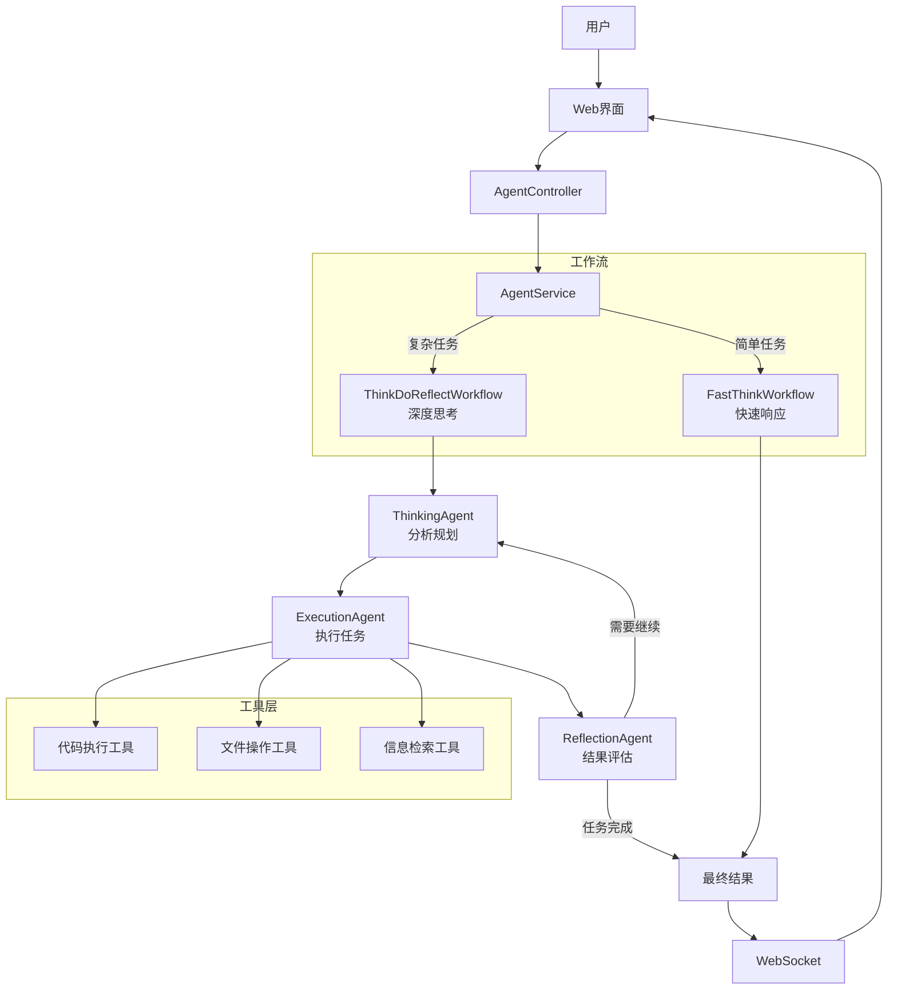

# OpenManusJava

<div align="center">


**基于 Java 的智能思考系统 - 快思考/慢思考多模式智能体框架**

[](https://openjdk.java.net/projects/jdk/21/)
[](https://spring.io/projects/spring-boot)
[](https://github.com/langchain4j/langchain4j)
[](LICENSE)

[🚀 快速开始](#-快速开始) •
[🎯 功能特性](#-功能特性) •
[🏗️ 架构设计](#️-架构设计) •

</div>

## 📋 项目概述

OpenManusJava 是一个基于 Spring Boot 和 LangChain4j 开发的智能思考系统，它采用"快思考/慢思考"双模式架构，结合了直接输出的效率与思考-执行-反思循环的深度。该系统能够根据任务复杂度自动或手动选择最合适的思考模式，大幅提升复杂任务的处理质量。

### 🎯 功能特性

#### 🧠 多模式智能思考
- **快思考模式**: 直接执行，高效响应，适合简单任务
- **慢思考模式**: 思考-执行-反思循环，适合复杂任务
- **自动模式**: 根据任务复杂度智能选择思考模式

#### 💭 智能Agent系统
- **FastThinkWorkflow**: 快速响应工作流
- **ThinkDoReflectWorkflow**: 循环反思工作流
- **多种专业Agent**: 思考、执行、反思等专业智能体

#### 🔧 工具生态
- **代码执行能力**: 执行代码并分析结果
- **文件操作工具**: 管理文件和内容
- **网络访问能力**: 智能检索信息

#### 🎨 用户界面
- **现代化三栏工作台**:
  - **左**: 智能对话台，用于核心人机交互。
  - **中**: 多功能工具面板，展示结构化搜索结果、工具输出和文件。
  - **右**: 浏览器工作区，具备多标签页、地址栏导航和双模式（网页/VNC）支持。
- **实时思考过程**: 可视化展示 AI 的思考步骤和日志。
- **响应式设计**: 适配桌面、平板和移动设备。

## 🏗️ 架构设计

### 核心架构图



### 技术栈

| **组件** | **技术选型** | **用途** |
|----------|-------------|---------|
| **后端框架** | Spring Boot 3.2.0 | 应用核心框架 |
| **AI集成** | LangChain4j 1.1.0 | LLM对接与多智能体协作 |
| **前端** | Vue.js 3 + Element Plus | 现代化、响应式用户界面 |
| **实时通信** | WebSocket + STOMP | 前后端实时消息与日志流 |
| **API** | RESTful API | 服务接口 |
| **文档** | Markdown | 项目文档 |

## 🚀 快速开始

### 环境要求

- **Java 21+**
- **Maven 3.9+**
- **阿里云百炼API Key** (或其他支持的LLM服务)

### 安装步骤

1. **克隆项目**
   ```bash
   git clone https://github.com/OpenManus/OpenManus-Java.git
   cd OpenManus-Java
   ```

2. **配置 API Key（推荐）**
   将 `dotenv.example` 复制为 `.env` 并填入你的 API Key：
   ```bash
   cp dotenv.example .env
   ```

3. **可选：覆盖应用配置**
   以 `src/main/resources/application-example.yml` 为参考，新建 `src/main/resources/application-local.yml` 写入你的个人覆盖配置。

4. **启动应用**
   ```bash
   mvn spring-boot:run
   ```
   如果你创建了 `application-local.yml`，可以通过 local profile 启动：
   ```bash
   mvn spring-boot:run -Dspring-boot.run.profiles=local
   ```

5. **访问服务**
   浏览器访问: http://localhost:8089

如需 Docker Compose 一键启动，请参考：`docs/QUICK_START.md`。

## 📊 使用方式

### 统一 API 入口

所有交互都通过统一的流式 API `think-do-reflect-stream` 进行，该 API 会自动处理并返回实时进度。

```bash
# 示例请求
curl -X POST http://localhost:8089/api/agent/think-do-reflect-stream \
  -H "Content-Type: application/json" \
  -d '{"input": "分析一下春节期间旅游行业的发展趋势"}'
```

### API 文档

Swagger UI：http://localhost:8089/swagger-ui.html

---

## 📬 联系我

- 微信：leochame007
- 邮箱：liulch.cn@gmail.com


## 🙏 致谢

感谢以下开源项目的支持：
- [LangChain4j](https://github.com/langchain4j/langchain4j)
- [Spring Boot](https://spring.io/projects/spring-boot)

## 📄 许可证

本项目采用 [MIT 许可证](LICENSE)。

---

<div align="center">

**🌟 如果这个项目对您有帮助，欢迎Star支持！**

</div>