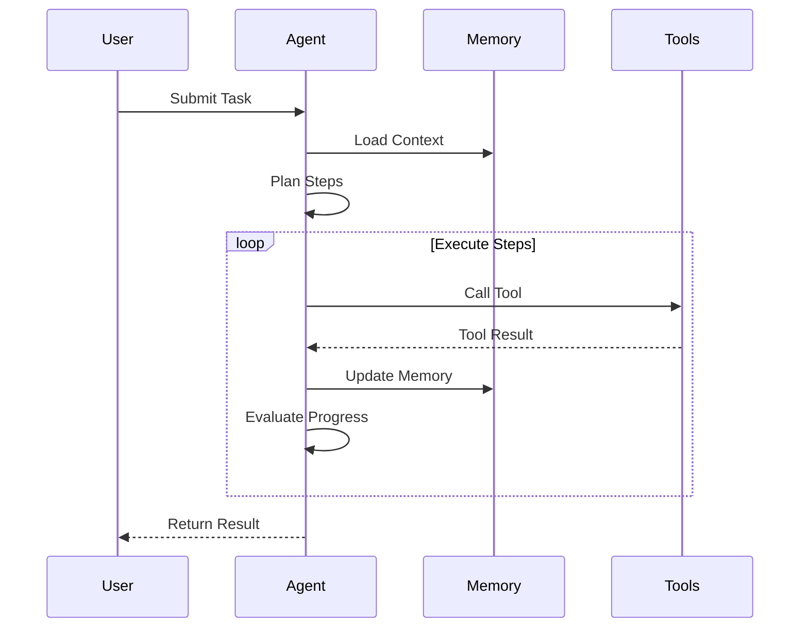
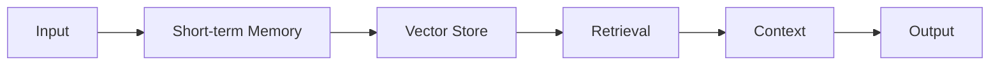
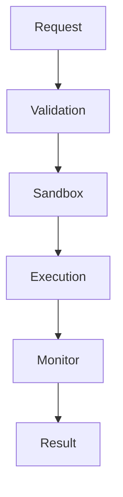

# OpenManus Java Architecture Documentation

## ? System Overview

OpenManus Java is an intelligent agent system based on Spring Boot and LangChain4j, using the ReAct reasoning framework and Chain of Thought demonstration.

### Core Features

- **ReAct Reasoning**: Intelligence dialogue based on reasoning and action
- **Chain of Thought**: Complete reasoning process demonstration
- **Tool Calls**: Support for Python, file operations, web browsing, etc.
- **Task Reflection**: Automatic task reflection and summarization
- **Web Interface**: Modern Apple-style UI

## ?? Technology Stack

### Backend
- **Java 17+** - Runtime environment
- **Spring Boot 3.2.0** - Application framework
- **LangChain4j** - AI services and tool framework
- **LangGraph4j 1.6.0-beta5** - State graph workflow engine, providing powerful Agent state management and workflow orchestration capabilities
- **Docker** - Sandbox environment

### Frontend  
- **Vue.js 3** - Frontend framework
- **Element Plus** - UI component library
- **WebSocket** - Real-time communication

## ? System Architecture

```
©°©¤©¤©¤©¤©¤©¤©¤©¤©¤©¤©¤©¤©¤©¤©¤©¤©¤©¤©¤©¤©¤©¤©¤©¤©¤©¤©¤©¤©¤©¤©¤©¤©¤©¤©¤©¤©¤©¤©¤©¤©¤©¤©¤©¤©¤©¤©¤©¤©¤©¤©¤©¤©¤©¤©¤©¤©¤©¤©¤©¤©¤©´
©¦                     Client Layer                            ©¦
©¦  Web Interface (Vue.js + Element Plus)  |  CLI              ©¦
©¸©¤©¤©¤©¤©¤©¤©¤©¤©¤©¤©¤©¤©¤©¤©¤©¤©¤©¤©¤©¤©¤©¤©¤©¤©¤©¤©¤©¤©¤©¤©¤©¤©¤©¤©¤©¤©¤©¤©¤©¤©¤©¤©¤©¤©¤©¤©¤©¤©¤©¤©¤©¤©¤©¤©¤©¤©¤©¤©¤©¤©¤©¼
                          ¡ý
©°©¤©¤©¤©¤©¤©¤©¤©¤©¤©¤©¤©¤©¤©¤©¤©¤©¤©¤©¤©¤©¤©¤©¤©¤©¤©¤©¤©¤©¤©¤©¤©¤©¤©¤©¤©¤©¤©¤©¤©¤©¤©¤©¤©¤©¤©¤©¤©¤©¤©¤©¤©¤©¤©¤©¤©¤©¤©¤©¤©¤©¤©´
©¦                     Web Service Layer                       ©¦
©¦  REST API  |  WebSocket Handler  |  Static Resource Service ©¦
©¸©¤©¤©¤©¤©¤©¤©¤©¤©¤©¤©¤©¤©¤©¤©¤©¤©¤©¤©¤©¤©¤©¤©¤©¤©¤©¤©¤©¤©¤©¤©¤©¤©¤©¤©¤©¤©¤©¤©¤©¤©¤©¤©¤©¤©¤©¤©¤©¤©¤©¤©¤©¤©¤©¤©¤©¤©¤©¤©¤©¤©¤©¼
                          ¡ý
©°©¤©¤©¤©¤©¤©¤©¤©¤©¤©¤©¤©¤©¤©¤©¤©¤©¤©¤©¤©¤©¤©¤©¤©¤©¤©¤©¤©¤©¤©¤©¤©¤©¤©¤©¤©¤©¤©¤©¤©¤©¤©¤©¤©¤©¤©¤©¤©¤©¤©¤©¤©¤©¤©¤©¤©¤©¤©¤©¤©¤©¤©´
©¦                     Core Service Layer                      ©¦
©¦                                                            ©¦
©¦  ©°©¤©¤©¤©¤©¤©¤©¤©¤©¤©¤©¤©¤©¤©´    ©°©¤©¤©¤©¤©¤©¤©¤©¤©¤©¤©¤©¤©¤©¤©´    ©°©¤©¤©¤©¤©¤©¤©¤©¤©¤©¤©¤©¤©¤©¤©´  ©¦
©¦  ©¦   Agent     ©¦    ©¦   Memory     ©¦    ©¦    Tool      ©¦  ©¦
©¦  ©¦  Service    ©¦¡û©¤©¤©¤©¦   Service    ©¦¡û©¤©¤©¤©¦   Service    ©¦  ©¦
©¦  ©¸©¤©¤©¤©¤©¤©¤©¤©¤©¤©¤©¤©¤©¤©¼    ©¸©¤©¤©¤©¤©¤©¤©¤©¤©¤©¤©¤©¤©¤©¤©¼    ©¸©¤©¤©¤©¤©¤©¤©¤©¤©¤©¤©¤©¤©¤©¤©¼  ©¦
©¦         ¡ý                   ¡ý                   ¡ý          ©¦
©¦  ©°©¤©¤©¤©¤©¤©¤©¤©¤©¤©¤©¤©¤©¤©´    ©°©¤©¤©¤©¤©¤©¤©¤©¤©¤©¤©¤©¤©¤©¤©´    ©°©¤©¤©¤©¤©¤©¤©¤©¤©¤©¤©¤©¤©¤©¤©´  ©¦
©¦  ©¦  StateGraph ©¦    ©¦    Vector    ©¦    ©¦   Sandbox    ©¦  ©¦
©¦  ©¦   Engine    ©¦    ©¦    Store     ©¦    ©¦  Container   ©¦  ©¦
©¦  ©¸©¤©¤©¤©¤©¤©¤©¤©¤©¤©¤©¤©¤©¤©¼    ©¸©¤©¤©¤©¤©¤©¤©¤©¤©¤©¤©¤©¤©¤©¤©¼    ©¸©¤©¤©¤©¤©¤©¤©¤©¤©¤©¤©¤©¤©¤©¤©¼  ©¦
©¦                                                            ©¦
©¸©¤©¤©¤©¤©¤©¤©¤©¤©¤©¤©¤©¤©¤©¤©¤©¤©¤©¤©¤©¤©¤©¤©¤©¤©¤©¤©¤©¤©¤©¤©¤©¤©¤©¤©¤©¤©¤©¤©¤©¤©¤©¤©¤©¤©¤©¤©¤©¤©¤©¤©¤©¤©¤©¤©¤©¤©¤©¤©¤©¤©¤©¼
                          ¡ý
©°©¤©¤©¤©¤©¤©¤©¤©¤©¤©¤©¤©¤©¤©¤©¤©¤©¤©¤©¤©¤©¤©¤©¤©¤©¤©¤©¤©¤©¤©¤©¤©¤©¤©¤©¤©¤©¤©¤©¤©¤©¤©¤©¤©¤©¤©¤©¤©¤©¤©¤©¤©¤©¤©¤©¤©¤©¤©¤©¤©¤©¤©´
©¦                     Infrastructure Layer                     ©¦
©¦  Docker | Database | Cache | Message Queue | Object Storage  ©¦
©¸©¤©¤©¤©¤©¤©¤©¤©¤©¤©¤©¤©¤©¤©¤©¤©¤©¤©¤©¤©¤©¤©¤©¤©¤©¤©¤©¤©¤©¤©¤©¤©¤©¤©¤©¤©¤©¤©¤©¤©¤©¤©¤©¤©¤©¤©¤©¤©¤©¤©¤©¤©¤©¤©¤©¤©¤©¤©¤©¤©¤©¤©¼
```

### Core Components

#### 1. Agent Service
- Task parsing and planning
- State management
- Tool orchestration
- Error handling

#### 2. Memory Service
- Short-term memory (conversation buffer)
- Long-term memory (vector store)
- Memory indexing and retrieval
- Memory cleaning strategy

#### 3. Tool Service
- Tool registration and management
- Sandbox execution environment
- Resource limitation
- Security control

### Key Processes

#### 1. Task Processing Flow


#### 2. Memory Management


#### 3. Tool Execution


### Security Architecture

#### 1. Sandbox Security
- Docker container isolation
- Resource limits
- Network access control
- File system restrictions

#### 2. API Security
- Authentication
- Rate limiting
- Input validation
- Error handling

#### 3. Data Security
- Memory encryption
- Sensitive data masking
- Access control
- Audit logging

## ? State Management

### Agent State
```java
public class AgentState {
    private String taskId;
    private String sessionId;
    private Map<String, Object> memory;
    private List<String> history;
    private Map<String, Object> toolResults;
}
```

### Memory Structure
```java
public class Memory {
    private ConversationBuffer shortTerm;
    private VectorStore longTerm;
    private Map<String, Object> metadata;
}
```

### Tool Registry
```java
public class ToolRegistry {
    private Map<String, Tool> tools;
    private SecurityManager security;
    private ResourceManager resources;
}
```

## ? Performance Optimization

### Memory Optimization
- Memory pooling
- Lazy loading
- Cache strategy
- Garbage collection

### Concurrent Processing
- Thread pool management
- Task queuing
- Resource allocation
- Load balancing

### Response Time
- Request caching
- Result buffering
- Async processing
- Timeout handling

## ? Monitoring and Logging

### Metrics Collection
- System metrics
- Business metrics
- Performance metrics
- Error metrics

### Log Management
- Operation logs
- Error logs
- Security logs
- Audit logs

### Alerting System
- Error alerts
- Performance alerts
- Security alerts
- Resource alerts

## ? Deployment Architecture

### Development Environment
```yaml
environment:
  profile: dev
  debug: true
  sandbox: local
  monitoring: basic
```

### Production Environment
```yaml
environment:
  profile: prod
  debug: false
  sandbox: docker
  monitoring: full
```

### High Availability
- Service clustering
- Load balancing
- Failover
- Backup strategy

## ? API Documentation

### REST APIs
- Task management
- Memory operations
- Tool operations
- System management

### WebSocket APIs
- Real-time updates
- State changes
- Progress tracking
- Error notifications

### Internal APIs
- Component communication
- State synchronization
- Resource management
- Security control