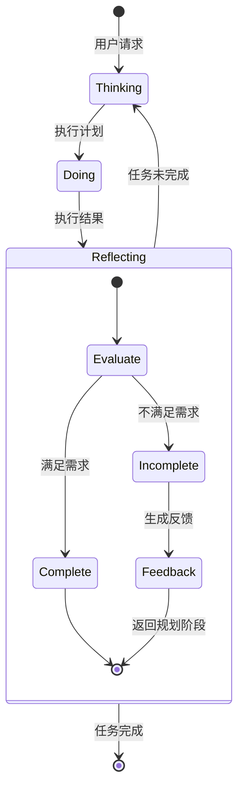

# 基于OpenManus AgentHandoff的多智能体自主协作系统实现指南

本文档详细介绍如何基于OpenManus的`AgentHandoff`机制和`AbstractAgent`框架实现"想、做、回"三步工作模式的多智能体自主协作系统，特别强调了反思循环机制的实现。

## 核心概念：循环反思机制

"想、做、回"框架的核心在于"回"阶段的反思与循环控制。系统通过反思智能体评估执行结果，决定任务是否完成，若未完成则返回"想"阶段重新规划，形成闭环优化过程。



## 基础架构

系统基于OpenManus已有的核心架构，利用`AgentHandoff`接口和`AbstractAgent`/`AbstractAgentExecutor`类，结合langgraph4j提供的状态图功能。

### 核心组件

```java
// 基于现有的OpenManus框架
import com.openmanus.java.agent.base.AbstractAgent;
import com.openmanus.java.agent.base.AbstractAgentExecutor;
import com.openmanus.java.agent.base.AgentHandoff;
import org.bsc.langgraph4j.StateGraph;
import org.bsc.langgraph4j.agentexecutor.AgentExecutor;
```

### 状态管理设计

状态管理直接利用langgraph4j提供的`AgentExecutor.State`，该类是一个灵活的Map封装，可以添加自定义字段。我们不需要创建新的状态类，而是在现有类基础上添加所需字段：

```java
// 在SupervisorAgent中初始化状态
Map<String, Object> state = (Map<String, Object>) context;

// 如果是首次执行，初始化自定义状态字段
if (!state.containsKey("original_request")) {
    state.put("original_request", request.arguments());
    state.put("cycle_count", 0);
    state.put("phase", "thinking");
    state.put("execution_history", new ArrayList<>());
    state.put("feedback", null);
    // messages字段已由框架初始化，无需手动添加
}
```

## 基于Tool的智能体工具集成

在OpenManus框架中，智能体之间的调用不应该通过硬编码判断实现，而应该遵循现有的工具化设计模式。我们将使用`@Tool`注解来定义智能体的功能接口，并通过工具目录进行集成：

### 智能体工具类

首先，创建一个包含所有智能体工具的类，使用`@Tool`注解定义接口：

```java
@Component
public class AgentToolbox {

    private final ThinkingAgent thinkingAgent;
    private final SearchAgent searchAgent;
    private final CodeAgent codeAgent;
    private final FileAgent fileAgent;
    private final ReflectionAgent reflectionAgent;

    public AgentToolbox(
            ThinkingAgent thinkingAgent,
            SearchAgent searchAgent,
            CodeAgent codeAgent,
            FileAgent fileAgent,
            ReflectionAgent reflectionAgent) {
        this.thinkingAgent = thinkingAgent;
        this.searchAgent = searchAgent;
        this.codeAgent = codeAgent;
        this.fileAgent = fileAgent;
        this.reflectionAgent = reflectionAgent;
    }

    @Tool("分析任务并创建执行计划")
    public String think(String prompt) {
        return thinkingAgent.execute(new ToolExecutionRequest("think", prompt), null);
    }

    @Tool("执行信息检索任务")
    public String search(String query) {
        return searchAgent.execute(new ToolExecutionRequest("search", query), null);
    }

    @Tool("执行代码相关任务")
    public String executeCode(String codeTask) {
        return codeAgent.execute(new ToolExecutionRequest("execute_code", codeTask), null);
    }

    @Tool("执行文件操作")
    public String handleFile(String fileOperation) {
        return fileAgent.execute(new ToolExecutionRequest("handle_file", fileOperation), null);
    }

    @Tool("评估执行结果")
    public String reflect(String executionResult) {
        return reflectionAgent.execute(new ToolExecutionRequest("reflect", executionResult), null);
    }
}
```

### 工具目录集成

创建一个工具目录类，类似于现有的`OmniToolCatalog`：

```java
@Component
public class AgentToolCatalog {

    private final AgentToolbox agentToolbox;
    // 可以添加其他工具，如WebSearchTool、PythonTool等

    public AgentToolCatalog(AgentToolbox agentToolbox) {
        this.agentToolbox = agentToolbox;
    }

    public List<Object> getTools() {
        return List.of(agentToolbox);
    }
}
```

## 监督者智能体实现

SupervisorAgent不再通过硬编码判断来路由请求，而是依赖于语言模型通过工具调用选择合适的智能体：

```java
public class SupervisorAgent extends AbstractAgentExecutor<SupervisorAgent.Builder> {
    
    // 防止无限循环的最大循环次数
    private static final int MAX_CYCLES = 5;
    
    public static class Builder extends AbstractAgentExecutor.Builder<Builder> {
        
        private AgentToolCatalog agentToolCatalog;
        
        public Builder agentToolCatalog(AgentToolCatalog agentToolCatalog) {
            this.agentToolCatalog = agentToolCatalog;
            return this;
        }
        
        public SupervisorAgent build() throws GraphStateException {
            this.name("supervisor")
                .description("负责协调整个智能体工作流程的智能体")
                .singleParameter("用户请求和执行上下文")
                .systemMessage(SystemMessage.from("""
                    你是智能体系统的总协调者，负责管理"想、做、回"的工作流程：
                    1. 想：使用think工具分析任务并规划
                    2. 做：根据需求使用适当的执行工具(search, execute_code, handle_file)
                    3. 回：使用reflect工具评估结果，决定是否需要继续循环
                    
                    你的主要职责是：
                    - 分析当前状态，选择合适的工具
                    - 管理执行循环，确保任务最终完成
                    - 监控执行进度，防止无限循环
                    
                    当你收到用户请求时，你应该：
                    1. 第一轮：调用think工具来规划任务
                    2. 然后根据计划调用适当的执行工具
                    3. 执行完成后调用reflect工具评估结果
                    4. 根据评估结果决定是否需要重新规划执行
                    
                    一定要跟踪cycle_count和phase字段，防止无限循环。
                    """));
            
            // 集成智能体工具
            if (agentToolCatalog != null) {
                for (Object tool : agentToolCatalog.getTools()) {
                    this.toolFromObject(tool);
                }
            }
            
            return new SupervisorAgent(this);
        }
    }
    
    public SupervisorAgent(Builder builder) throws GraphStateException {
        super(builder);
    }
    
    @Override
    public String execute(ToolExecutionRequest request, Object context) {
        // 初始化并管理状态
        Map<String, Object> state = (Map<String, Object>) context;
        
        // 首次执行时初始化状态
        if (!state.containsKey("original_request")) {
            state.put("original_request", request.arguments());
            state.put("cycle_count", 0);
            state.put("phase", "thinking");
            state.put("execution_history", new ArrayList<>());
        }
        
        // 检查循环次数是否超限
        int cycleCount = (int) state.getOrDefault("cycle_count", 0);
        if (cycleCount >= MAX_CYCLES) {
            state.put("phase", "completed");
            state.put("final_result", "已达到最大循环次数，返回当前最佳结果。");
            return "已达到最大循环次数(" + MAX_CYCLES + ")，返回当前最佳结果。";
        }
        
        // 调用内部AgentExecutor处理请求
        // 注意：这里不需要自己判断和路由，language model会自动选择合适的工具
        return super.execute(request, context);
    }
}
```

## 反思智能体实现

反思智能体实现不变，负责评估结果并决定是否需要继续循环：

```java
public class ReflectionAgent extends AbstractAgentExecutor<ReflectionAgent.Builder> {
    
    // 状态常量
    private static final String STATUS_COMPLETE = "STATUS: COMPLETE";
    private static final String STATUS_INCOMPLETE = "STATUS: INCOMPLETE";
    
    public static class Builder extends AbstractAgentExecutor.Builder<Builder> {
        public ReflectionAgent build() throws GraphStateException {
            this.name("reflection_agent")
                .description("负责评估执行结果并决定是否需要继续循环的智能体")
                .singleParameter("执行结果和任务上下文")
                .systemMessage(SystemMessage.from("""
                    你是一位严格的评估专家，你的核心任务是判断执行结果是否完全满足原始需求。
                    
                    评估流程：
                    1. 仔细对比原始用户请求与当前执行结果
                    2. 全面评估结果的完整性、准确性和质量
                    3. 明确判断任务是否完成
                    
                    如果任务完全完成（所有需求都已满足）：
                    - 总结执行结果
                    - 输出必须包含标记："STATUS: COMPLETE"
                    
                    如果任务未完成（任何方面不满足需求）：
                    - 具体指出哪些方面不满足要求
                    - 提供详细、具体的改进建议
                    - 输出必须包含标记："STATUS: INCOMPLETE"
                    - 在"FEEDBACK:"部分提供给下一轮规划的具体指导
                    
                    请注意：你的判断将决定系统是否进行下一轮迭代，务必谨慎评估！
                    """));
            return new ReflectionAgent(this);
        }
    }
    
    public ReflectionAgent(Builder builder) throws GraphStateException {
        super(builder);
    }
    
    @Override
    public String execute(ToolExecutionRequest request, Object context) {
        // 如果是来自AgentHandoff的调用，context是AgentExecutor.State
        // 如果是来自AgentToolbox的调用，context为null，需要从请求参数中提取必要信息
        
        String originalRequest;
        String executionResult;
        int cycleCount;
        Map<String, Object> state = null;
        
        if (context != null) {
            // 来自AgentHandoff的调用
            state = (Map<String, Object>) context;
            originalRequest = (String) state.get("original_request");
            executionResult = request.arguments(); // 从请求中获取
            cycleCount = (int) state.getOrDefault("cycle_count", 0);
        } else {
            // 来自AgentToolbox的调用，从参数中解析
            String args = request.arguments();
            // 假设参数格式为 JSON 字符串
            try {
                // 使用简单的字符串解析，实际应使用JSON解析
                originalRequest = extractField(args, "original_request");
                executionResult = extractField(args, "execution_result");
                cycleCount = Integer.parseInt(extractField(args, "cycle_count", "0"));
            } catch (Exception e) {
                return "参数格式错误，无法解析请求。";
            }
        }
        
        // 构建评估提示
        String evaluationPrompt = String.format(
            "原始请求: %s\n\n当前执行结果: %s\n\n这是第%d轮执行。请评估结果是否完全满足原始需求。",
            originalRequest, executionResult, cycleCount + 1
        );
        
        // 调用基础模型进行评估
        String evaluationResult;
        if (context != null) {
            // 使用内部的AgentExecutor处理
            evaluationResult = super.execute(new ToolExecutionRequest("evaluate", evaluationPrompt), context);
        } else {
            // 直接构造结果 (实际实现需要调用语言模型)
            evaluationResult = "模拟评估结果";
        }
        
        // 处理评估结果
        boolean isComplete = evaluationResult.contains(STATUS_COMPLETE);
        
        // 更新状态（如果有）
        if (state != null) {
            if (isComplete) {
                state.put("phase", "completed");
                state.put("final_result", extractFinalResult(evaluationResult));
            } else {
                String feedback = extractFeedback(evaluationResult);
                state.put("phase", "thinking");
                state.put("cycle_count", cycleCount + 1);
                state.put("feedback", feedback);
                
                // 记录本轮执行历史
                List<Map<String, Object>> history = (List<Map<String, Object>>) 
                    state.getOrDefault("execution_history", new ArrayList<>());
                
                Map<String, Object> currentExecution = new HashMap<>();
                currentExecution.put("cycle", cycleCount);
                currentExecution.put("result", executionResult);
                currentExecution.put("evaluation", evaluationResult);
                history.add(currentExecution);
                
                state.put("execution_history", history);
            }
        }
        
        // 返回评估结果
        if (isComplete) {
            return "任务已完成: " + extractFinalResult(evaluationResult);
        } else {
            String feedback = extractFeedback(evaluationResult);
            return "任务未完成，需要进一步改进: " + feedback;
        }
    }
    
    // 辅助方法
    private String extractField(String json, String fieldName) {
        return extractField(json, fieldName, "");
    }
    
    private String extractField(String json, String fieldName, String defaultValue) {
        // 简单实现，实际应使用JSON解析
        int startIndex = json.indexOf("\"" + fieldName + "\":");
        if (startIndex == -1) return defaultValue;
        
        startIndex += fieldName.length() + 3;
        int endIndex = json.indexOf("\",", startIndex);
        if (endIndex == -1) endIndex = json.indexOf("\"}", startIndex);
        if (endIndex == -1) return defaultValue;
        
        return json.substring(startIndex, endIndex);
    }
    
    private String extractFinalResult(String evaluationResult) {
        // 提取最终结果的逻辑
        int summaryIndex = evaluationResult.indexOf("SUMMARY:");
        if (summaryIndex != -1) {
            return evaluationResult.substring(summaryIndex + 8).trim();
        }
        return evaluationResult;
    }
    
    private String extractFeedback(String evaluationResult) {
        // 提取反馈的逻辑
        int feedbackIndex = evaluationResult.indexOf("FEEDBACK:");
        if (feedbackIndex != -1) {
            return evaluationResult.substring(feedbackIndex + 9).trim();
        }
        
        // 如果没有明确标记，尝试提取STATUS: INCOMPLETE后的内容
        int incompleteIndex = evaluationResult.indexOf(STATUS_INCOMPLETE);
        if (incompleteIndex != -1) {
            return evaluationResult.substring(incompleteIndex + STATUS_INCOMPLETE.length()).trim();
        }
        
        return evaluationResult;
    }
}
```

## 思考智能体实现

思考智能体同样适配两种调用方式：

```java
public class ThinkingAgent extends AbstractAgentExecutor<ThinkingAgent.Builder> {
    
    public static class Builder extends AbstractAgentExecutor.Builder<Builder> {
        public ThinkingAgent build() throws GraphStateException {
            this.name("thinking_agent")
                .description("负责任务分析和规划的智能体")
                .singleParameter("用户请求和任务上下文")
                .systemMessage(SystemMessage.from("""
                    你是规划专家，负责：
                    1. 分析用户请求，理解真正的需求
                    2. 将复杂任务分解为清晰的步骤
                    3. 制定详细的执行计划
                    
                    如果这是第一轮规划，你需要从零开始分析任务。
                    如果这是后续轮次，你将收到前一轮的反思反馈。请仔细分析反馈，调整你的规划。
                    
                    输出必须包括：
                    1. 任务分析：对请求的理解
                    2. 执行步骤：清晰的步骤列表
                    3. 具体执行计划：详细的操作指南
                    """));
            return new ThinkingAgent(this);
        }
    }
    
    public ThinkingAgent(Builder builder) throws GraphStateException {
        super(builder);
    }
    
    @Override
    public String execute(ToolExecutionRequest request, Object context) {
        String thinkingResult;
        
        if (context != null) {
            // 来自AgentHandoff的调用，使用内部AgentExecutor处理
            thinkingResult = super.execute(request, context);
            
            // 更新状态
            Map<String, Object> state = (Map<String, Object>) context;
            state.put("execution_plan", thinkingResult);
            state.put("phase", "doing");
        } else {
            // 直接调用，从参数中解析必要信息
            // 这里只是模拟，实际实现需调用语言模型
            thinkingResult = "基于输入「" + request.arguments() + "」的规划结果";
        }
        
        return thinkingResult;
    }
}
```

## 完整工作流集成

将所有智能体通过AgentHandoff集成，实现完整的循环执行流程：

```java
@Service
public class ThinkDoReflectWorkflow {
    
    private final CompiledGraph<AgentExecutor.State> handoffExecutor;
    
    public ThinkDoReflectWorkflow(
            ChatModel chatModel, 
            AgentToolCatalog agentToolCatalog,
            ThinkingAgent thinkingAgent,
            SearchAgent searchAgent,
            CodeAgent codeAgent,
            FileAgent fileAgent,
            ReflectionAgent reflectionAgent) throws GraphStateException {
        
        // 创建SupervisorAgent
        SupervisorAgent supervisorAgent = new SupervisorAgent.Builder()
                .chatModel(chatModel)
                .agentToolCatalog(agentToolCatalog)
                .build();
                
        // 构建handoff工作流
        this.handoffExecutor = new AgentHandoff.Builder()
                .chatModel(chatModel)
                .agent(supervisorAgent)  // SupervisorAgent作为入口点
                .agent(thinkingAgent)
                .agent(searchAgent)
                .agent(codeAgent)
                .agent(fileAgent)
                .agent(reflectionAgent)
                .build()
                .compile();
    }
    
    public CompletableFuture<String> execute(String userInput) {
        // 初始化最小状态，只包含messages字段
        Map<String, Object> initialState = Map.of("messages", UserMessage.from(userInput));
        
        return CompletableFuture.supplyAsync(() -> handoffExecutor.invoke(initialState))
                .thenApply(response -> response
                        .flatMap(AgentExecutor.State::finalResponse)
                        .orElse("未收到智能体响应"));
    }
    
    // 用于支持进度追踪的方法
    public Stream<String> executeWithProgress(String userInput) {
        Map<String, Object> initialState = Map.of("messages", UserMessage.from(userInput));
        
        return handoffExecutor.stream(initialState)
                .map(stateOpt -> stateOpt
                        .flatMap(AgentExecutor.State::currentResponse)
                        .orElse("处理中..."));
    }
}
```

## 反思循环的状态转换示例

以下是一个完整的状态转换示例，展示了"想、做、回"循环如何工作：

```
【初始状态】
{
  "messages": [UserMessage对象],  // 由框架自动初始化
  
  // SupervisorAgent初始化的自定义字段
  "original_request": "分析最近5年的股市数据，预测下一季度趋势",
  "cycle_count": 0,
  "phase": "thinking",
  "execution_history": []
}

【第1轮 - 思考后】
{
  // ... 前面的状态 ...
  "phase": "doing",
  "execution_plan": "1. 收集近5年股市数据\n2. 进行时间序列分析\n3. 建立预测模型..."
}

【第1轮 - 执行后】
{
  // ... 前面的状态 ...
  "phase": "reflecting",
  "execution_result": "分析结果：股市整体呈上升趋势，但数据分析不够深入..."
}

【第1轮 - 反思后 - 未完成】
{
  // ... 前面的状态 ...
  "phase": "thinking",
  "cycle_count": 1,
  "feedback": "数据分析不够全面，缺乏行业细分和波动性分析，预测模型过于简单",
  "execution_history": [
    {
      "cycle": 0,
      "result": "分析结果：股市整体呈上升趋势，但数据分析不够深入...",
      "evaluation": "STATUS: INCOMPLETE\n数据分析不够全面，缺乏行业细分..."
    }
  ]
}

【第2轮 - 思考后】
{
  // ... 前面的状态 ...
  "phase": "doing",
  "execution_plan": "1. 扩展数据分析，添加行业细分\n2. 计算波动性指标\n3. 采用更复杂的ARIMA模型..."
}

// ... 循环继续，直到完成或达到最大循环次数 ...

【最终状态 - 任务完成】
{
  // ... 前面的状态 ...
  "phase": "completed",
  "final_result": "基于全面的行业分析和先进预测模型，预测下季度市场将温和上涨5-7%，科技和医疗行业表现最佳..."
}
```

## 实现优化建议

1. **轻量级状态传递**
   - 仅保留必要的状态信息，避免状态膨胀
   - 使用增量更新，只传递变化的部分

2. **反思质量优化**
   - 为不同任务类型制定具体的评估标准
   - 反思提示精细化，包含更多具体指导

3. **循环效率改进**
   - 动态调整MAX_CYCLES，根据任务复杂度和改进幅度
   - 添加早期终止条件，如改进幅度低于阈值

4. **并行处理能力**
   - 对于复杂任务，支持子任务并行执行
   - 结果汇总与整合机制

5. **人机协作增强**
   - 允许在关键点插入人类反馈
   - 提供进度可视化和干预机制

## 结论

通过基于现有AgentExecutor.State实现循环反思机制，并采用Tool注解方式实现智能体间调用，系统能够灵活高效地支持"想、做、回"工作模式。这种实现方式完全符合OpenManus框架的设计理念，易于扩展和维护。 