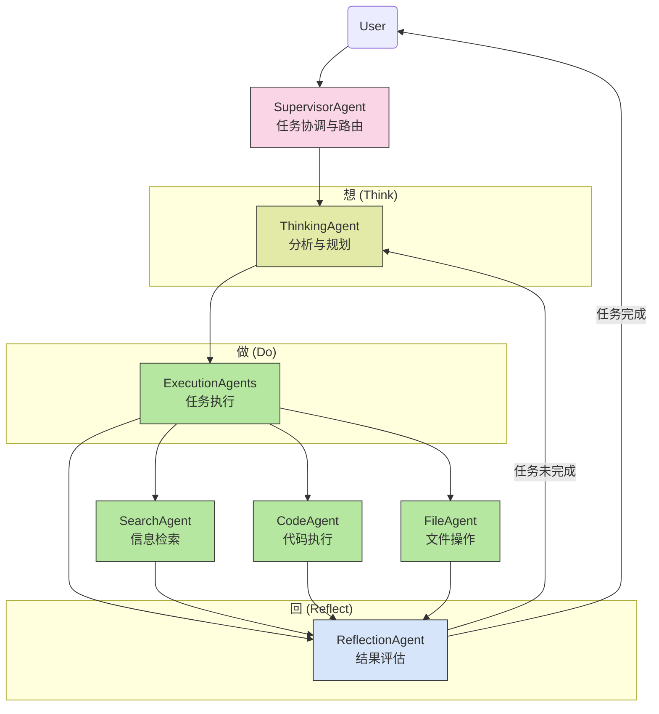

# 基于OpenManus AgentHandoff的多智能体自主协作系统开发计划

## 概述

本文档概述了基于OpenManus的`AgentHandoff`机制实现"想、做、回"(Think, Do, Reflect)工作流的多智能体自主协作系统开发计划。系统的核心在于通过反思智能体的自我评估能力，实现任务的循环规划和执行，直至完成目标。

## 工作流程图



## 核心架构

### 关键组件

1. **智能体框架**
   - 基于OpenManus的`AbstractAgent`和`AbstractAgentExecutor`
   - 利用`AgentHandoff`接口实现智能体间的任务交接
   - 通过langgraph4j管理状态流转

2. **智能体类型**
   - **SupervisorAgent**: 总体协调者，负责智能体路由和循环控制
   - **ThinkingAgent**: 任务分析与规划
   - **执行智能体**: 根据任务类型有不同专业化实现（SearchAgent, CodeAgent等）
   - **ReflectionAgent**: 结果评估与循环决策

3. **循环执行机制**
   - 基于ReflectionAgent的评估结果决定是否重新规划
   - 通过状态传递实现反馈循环
   - 包含循环计数和终止条件，防止无限循环

## 实现阶段

### 第1阶段：基础架构开发

1. **智能体基类实现**
   - 扩展OpenManus基础类
   - 实现状态传递机制
   - 开发循环控制逻辑

2. **反思评估机制**
   - 实现任务完成度评估
   - 开发改进建议生成
   - 构建循环反馈通道

### 第2阶段：智能体实现

1. **SupervisorAgent实现**
   - 智能体路由逻辑
   - 循环控制机制
   - 状态管理与传递

2. **ThinkingAgent实现**
   - 任务理解与分解
   - 执行计划生成
   - 接收反思反馈并调整规划

3. **执行智能体实现**
   - 专业化执行能力
   - 结果记录与状态更新
   - 错误处理机制

4. **ReflectionAgent实现**
   - 执行结果评估
   - 完成度判断逻辑
   - 改进建议生成
   - 循环决策机制

### 第3阶段：集成与测试

1. **状态流转测试**
   - 验证状态传递正确性
   - 测试循环执行机制
   - 防止状态污染

2. **循环终止条件测试**
   - 正常完成场景
   - 最大循环次数场景
   - 无法完成任务场景

## 技术实现细节

### 状态传递与循环控制

```java
public class SupervisorAgent extends AbstractAgentExecutor<SupervisorAgent.Builder> {
    
    private static final int MAX_CYCLES = 5; // 防止无限循环
    
    @Override
    public String execute(ToolExecutionRequest request, Object context) {
        Map<String, Object> state = (Map<String, Object>)context;
        String phase = (String)state.getOrDefault("phase", "thinking");
        int cycleCount = (int)state.getOrDefault("cycle_count", 0);
        
        // 检查循环次数
        if (cycleCount >= MAX_CYCLES) {
            return "Reached maximum planning cycles. Current best result: " + 
                   state.getOrDefault("current_result", "No satisfactory result");
        }
        
        // 根据当前阶段选择智能体
        if ("thinking".equals(phase)) {
            return callThinkingAgent(request.arguments());
        } else if ("doing".equals(phase)) {
            return callExecutionAgent(request.arguments());
        } else if ("reflecting".equals(phase)) {
            String reflectionResult = callReflectionAgent(request.arguments());
            
            // 解析反思结果
            if (reflectionResult.contains("STATUS: INCOMPLETE")) {
                // 关键循环点：任务未完成，返回规划阶段
                state.put("phase", "thinking");
                state.put("cycle_count", cycleCount + 1);
                state.put("feedback", extractFeedback(reflectionResult));
                return "Task incomplete. Re-planning with feedback...";
            } else {
                // 任务完成
                return "Task completed successfully: " + extractSummary(reflectionResult);
            }
        }
        
        return "Unknown phase: " + phase;
    }
}
```

### 反思智能体实现

```java
public class ReflectionAgent extends AbstractAgentExecutor<ReflectionAgent.Builder> {
    
    public static class Builder extends AbstractAgentExecutor.Builder<Builder> {
        public ReflectionAgent build() throws GraphStateException {
            this.name("reflection_agent")
                .description("负责结果评估和反思的智能体")
                .singleParameter("任务执行结果和上下文")
                .systemMessage(SystemMessage.from("""
                    你是评估与反思专家，你的关键任务是判断执行结果是否完全满足原始需求：
                    
                    1. 仔细评估执行结果与原始用户需求的匹配程度
                    2. 分析执行过程中的成功点和不足点
                    3. 明确判断任务是否完成
                    
                    如果任务未完成：
                    - 明确指出哪些部分未完成
                    - 提出具体的改进建议
                    - 输出必须包含："STATUS: INCOMPLETE"
                    - 提供具体的改进建议以供下一轮规划参考
                    
                    如果任务已经完成：
                    - 总结执行结果
                    - 输出必须包含："STATUS: COMPLETE"
                    
                    这个判断对系统是否继续规划执行至关重要，务必谨慎评估。
                    """));
            return new ReflectionAgent(this);
        }
    }
    
    // 其他实现代码...
}
```

### 工作流构建

```java
@Service
public class ThinkDoReflectWorkflow {
    
    private final CompiledGraph<AgentExecutor.State> handoffExecutor;
    
    public ThinkDoReflectWorkflow(ChatModel chatModel, AgentToolCatalog toolCatalog) throws GraphStateException {
        
        // 创建各智能体...
        
        // 构建工作流
        this.handoffExecutor = new AgentHandoff.Builder()
                .chatModel(chatModel)
                .agent(supervisorAgent)
                .agent(thinkingAgent)
                .agent(searchAgent)
                .agent(codeAgent)
                .agent(fileAgent)
                .agent(reflectionAgent)
                .build()
                .compile();
    }
    
    public CompletableFuture<String> execute(String userInput) {
        // 初始化状态
        Map<String, Object> initialState = new HashMap<>();
        initialState.put("messages", UserMessage.from(userInput));
        initialState.put("phase", "thinking");
        initialState.put("cycle_count", 0);
        initialState.put("original_request", userInput);
        
        return CompletableFuture.supplyAsync(() -> handoffExecutor.invoke(initialState))
                .thenApply(response -> response
                        .flatMap(AgentExecutor.State::finalResponse)
                        .orElse("未收到智能体响应"));
    }
}
```

## 完整工作流程

1. **接收用户请求**
   - 初始化状态，设置phase="thinking"，cycle_count=0
   - SupervisorAgent分析请求并路由到ThinkingAgent

2. **思考阶段 (Think)**
   - ThinkingAgent分析任务并制定执行计划
   - 输出执行步骤和所需工具
   - 更新状态，设置phase="doing"

3. **执行阶段 (Do)**
   - 根据任务类型路由到专业执行智能体
   - 执行智能体完成任务并记录结果
   - 更新状态，设置phase="reflecting"

4. **反思阶段 (Reflect)**
   - ReflectionAgent评估执行结果
   - 判断任务是否完成
   
5. **循环决策（核心）**
   - 若任务完成：返回最终结果给用户
   - 若任务未完成：
     - 更新状态：phase="thinking"
     - 增加循环计数：cycle_count += 1
     - 添加改进建议：feedback=反思结果
     - 返回ThinkingAgent进行重新规划

6. **循环终止条件**
   - 任务成功完成
   - 达到最大循环次数 (MAX_CYCLES)

## 关键特性

1. **自主循环执行**
   - 基于反思结果自动决定是否继续循环
   - 每次循环带入前次反馈，持续改进

2. **反思驱动改进**
   - 反思智能体评估执行结果的完整性
   - 提供具体改进建议指导后续规划

3. **灵活执行路径**
   - 根据任务需求选择不同的执行智能体
   - 处理多种类型的执行能力

## 实现与部署计划

1. **月度计划**
   - 第1月：核心架构设计与基础组件实现
   - 第2月：智能体开发与循环机制实现
   - 第3月：集成测试与性能优化
   - 第4月：扩展功能与文档完善

2. **关键里程碑**
   - 核心循环机制验证
   - 多类型任务执行测试
   - 稳定性与可靠性评估 