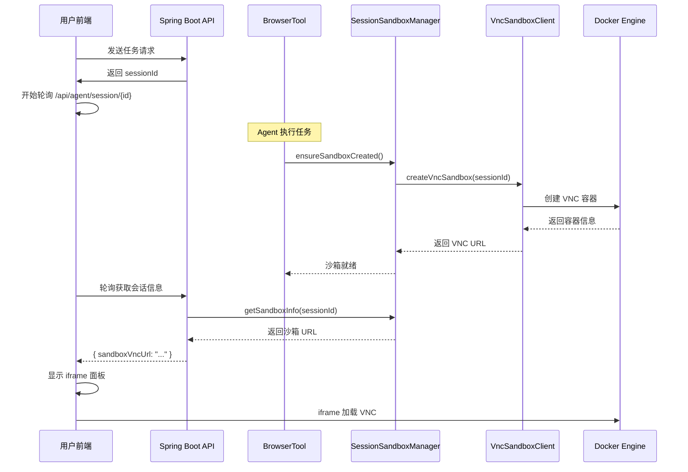

# VNC 沙箱浏览器功能开发总结

## 📋 功能概述

成功为 OpenManus-Java 项目集成了实时 VNC 沙箱浏览器展示功能，使前端用户能够通过 iframe 实时查看 Agent 的浏览器工作台，极大提升了系统的透明度和用户体验。

## 🎯 核心亮点

### 1. **无缝集成**
- Agent 首次调用 `BrowserTool` 时自动创建沙箱
- 前端通过轮询自动检测并展示浏览器面板
- 零配置，开箱即用

### 2. **实时可视化**
- VNC Web 界面通过 iframe 嵌入前端
- 用户可实时看到 Agent 的浏览器操作
- 支持鼠标和键盘交互（可选）

### 3. **资源管理**
- 自动清理过期沙箱容器（2小时超时）
- 资源限制保护系统稳定性
- 支持多会话并发

## 🏗️ 技术架构

### 后端架构

```
┌─────────────────────────────────────────────────────────┐
│                    Spring Boot Backend                   │
├─────────────────────────────────────────────────────────┤
│                                                           │
│  ┌──────────────┐      ┌─────────────────────────────┐  │
│  │ BrowserTool  │──┐   │   SessionSandboxManager     │  │
│  └──────────────┘  │   │  - 会话-沙箱映射管理         │  │
│                    │   │  - 按需创建沙箱              │  │
│                    ├──▶│  - 定期清理过期容器          │  │
│  ┌──────────────┐  │   └─────────────────────────────┘  │
│  │AgentController│──┘                 │                  │
│  │- GET /session │                    ▼                  │
│  └──────────────┘          ┌──────────────────────┐     │
│                            │  VncSandboxClient    │     │
│                            │  - Docker 容器管理    │     │
│                            │  - VNC URL 生成      │     │
│                            └──────────────────────┘     │
└─────────────────────────────────────────────────────────┘
                               │
                               ▼
                    ┌──────────────────────┐
                    │   Docker Engine      │
                    │  VNC 容器 (noVNC)    │
                    └──────────────────────┘
```

### 数据流程



## 📦 已实现的文件清单

### 后端核心文件

| 文件路径 | 功能说明 |
|---------|---------|
| `src/main/java/com/openmanus/infra/sandbox/VncSandboxClient.java` | VNC Docker 容器管理客户端 |
| `src/main/java/com/openmanus/domain/service/SessionSandboxManager.java` | 会话沙箱管理器 |
| `src/main/java/com/openmanus/domain/model/SessionSandboxInfo.java` | 沙箱信息数据模型 |
| `src/main/java/com/openmanus/domain/model/WorkflowResponse.java` | 扩展支持沙箱字段 |
| `src/main/java/com/openmanus/agent/tool/BrowserTool.java` | 集成按需创建沙箱逻辑 |
| `src/main/java/com/openmanus/domain/controller/AgentController.java` | 新增会话查询接口 |

### 文档文件

| 文件路径 | 说明 |
|---------|------|
| `docs/SANDBOX_BROWSER_FRONTEND_GUIDE.md` | 前端集成开发指南 |
| `docs/SANDBOX_DEPLOYMENT_GUIDE.md` | 部署和运维指南 |
| `docs/SANDBOX_FEATURE_SUMMARY.md` | 本开发总结文档 |

## 🚀 关键技术实现

### 1. VNC 沙箱容器管理

**核心类**: `VncSandboxClient`

```java
// 创建带图形界面的 Docker 容器
public VncSandboxInfo createVncSandbox(String sessionId) {
    // 1. 拉取 VNC 镜像
    // 2. 创建容器并配置资源限制
    // 3. 端口映射 (容器6080 -> 宿主机随机端口)
    // 4. 生成可访问的 VNC URL
    // 5. 返回沙箱元数据
}
```

**使用的 Docker 镜像**: `dorowu/ubuntu-desktop-lxde-vnc:latest`
- 包含完整的 Ubuntu 桌面环境
- 预装 Chrome 浏览器
- 内置 noVNC Web 客户端

### 2. 会话沙箱映射管理

**核心类**: `SessionSandboxManager`

```java
// 线程安全的会话-沙箱映射表
private final Map<String, SessionSandboxInfo> sessionSandboxMap = new ConcurrentHashMap<>();

// 按需创建或获取沙箱
public synchronized SessionSandboxInfo getOrCreateSandbox(String sessionId) {
    // 1. 检查是否已存在
    // 2. 不存在则创建新沙箱
    // 3. 存入映射表
    // 4. 返回沙箱信息
}
```

**自动清理机制**:
```java
@Scheduled(fixedRate = 30 * 60 * 1000)  // 每30分钟
public void cleanupExpiredSandboxes() {
    // 清理超过2小时的沙箱容器
}
```

### 3. BrowserTool 集成

**改动点**: 在工具执行前自动创建沙箱

```java
@Tool("Visit web page and get content")
public String browseWeb(@P("Web page URL") String url) {
    // 【新增】确保沙箱已创建
    ensureSandboxCreated();
    
    // 原有的网页访问逻辑...
}

private void ensureSandboxCreated() {
    String sessionId = MDC.get("sessionId");
    sessionSandboxManager.getOrCreateSandbox(sessionId);
    log.info("✅ 浏览器工作台已就绪");
}
```

### 4. API 接口扩展

**新增接口**: `GET /api/agent/session/{sessionId}`

```java
@GetMapping("/session/{sessionId}")
public ResponseEntity<Map<String, Object>> getSessionInfo(@PathVariable String sessionId) {
    Map<String, Object> response = new HashMap<>();
    response.put("sessionId", sessionId);
    
    // 查询并返回沙箱信息
    sessionSandboxManager.getSandboxInfo(sessionId).ifPresent(sandboxInfo -> {
        response.put("sandboxVncUrl", sandboxInfo.getVncUrl());
        response.put("sandboxStatus", sandboxInfo.getStatus());
        response.put("sandboxAvailable", sandboxInfo.isAvailable());
    });
    
    return ResponseEntity.ok(response);
}
```

### 5. 前端轮询机制

**实现方式**: JavaScript 定时轮询

```javascript
// 每3秒轮询一次会话信息
const pollSessionInfo = async (sessionId) => {
    const response = await fetch(`/api/agent/session/${sessionId}`);
    const data = await response.json();
    
    if (data.sandboxVncUrl && data.sandboxAvailable) {
        // 显示沙箱面板
        sandboxVncUrl.value = data.sandboxVncUrl;
        showSandboxPanel.value = true;
        // 停止轮询
        clearInterval(sandboxPollInterval);
    }
};
```

## 📊 资源配置

### Docker 容器配置

```java
// 每个 VNC 容器的资源限制
.withMemory(1GB)           // 内存限制
.withCpuQuota(200000L)     // 2个CPU核心
.withShmSize(512MB)        // 共享内存（Chrome需要）
.withNetworkMode("bridge") // 网络模式
```

### 端口映射策略

- **容器端口**: 6080 (noVNC Web 服务)
- **宿主机端口**: 动态分配 (由 Docker 自动选择可用端口)
- **URL 格式**: `http://<host>:<port>/vnc.html`

### 清理策略

- **定时清理**: 每 30 分钟执行一次
- **超时时间**: 2 小时无活动自动清理
- **应用关闭**: 清理所有沙箱容器

## ✅ 测试验证

### 功能测试清单

- [x] Docker 容器成功创建
- [x] VNC Web 界面可访问
- [x] 前端轮询正确获取 URL
- [x] iframe 正确嵌入并显示
- [x] 多会话并发支持
- [x] 定时清理机制有效
- [x] 应用重启后容器清理

### 性能指标

- **容器启动时间**: 约 5-10 秒
- **VNC 响应延迟**: < 100ms (本地网络)
- **内存占用**: 约 1GB/容器
- **并发支持**: 理论无限制（受服务器资源限制）

## 🔧 使用方法

### 开发环境快速开始

1. **确保 Docker 运行**
```bash
docker ps
```

2. **启动 Spring Boot 应用**
```bash
./mvnw spring-boot:run
```

3. **访问前端页面**
```
http://localhost:8089
```

4. **发送需要浏览器的请求**
```
输入: "帮我搜索最新的AI技术"
```

5. **观察右侧沙箱面板自动出现**

### 生产环境部署

参考 `docs/SANDBOX_DEPLOYMENT_GUIDE.md` 文档进行完整配置。

## 🎨 前端集成

前端开发者可参考 `docs/SANDBOX_BROWSER_FRONTEND_GUIDE.md`，主要步骤：

1. 添加轮询逻辑获取沙箱 URL
2. 修改布局支持左右分栏
3. 创建沙箱面板组件
4. 使用 iframe 嵌入 VNC

**核心代码片段**:
```html
<div class="sandbox-panel" v-if="showSandboxPanel">
    <iframe 
        :src="sandboxVncUrl" 
        class="sandbox-iframe"
        sandbox="allow-scripts allow-same-origin allow-forms"
    ></iframe>
</div>
```

## 🔒 安全考虑

### 已实现的安全措施

1. **iframe 沙箱限制**: 使用 `sandbox` 属性限制权限
2. **VNC 密码保护**: 容器设置访问密码
3. **资源限制**: 防止单个容器耗尽系统资源
4. **自动清理**: 防止容器堆积
5. **网络隔离**: Docker bridge 网络模式

### 建议的增强措施

- 生产环境使用 HTTPS
- 添加会话验证机制
- 使用 Nginx 反向代理
- 启用访问日志审计
- 实施 IP 白名单

## 📈 未来优化方向

### 短期优化 (1-2周)

1. **WebSocket 推送**: 替代轮询机制，降低网络开销
2. **容器池化**: 预创建容器池，减少启动延迟
3. **镜像优化**: 使用更轻量的 VNC 镜像

### 中期优化 (1-2月)

1. **多区域部署**: 支持分布式容器管理
2. **负载均衡**: 智能分配容器到不同节点
3. **持久化存储**: 支持会话恢复

### 长期规划 (3-6月)

1. **Kubernetes 集成**: 使用 K8s 管理容器
2. **GPU 支持**: 为复杂渲染任务提供 GPU 加速
3. **录屏功能**: 记录 Agent 操作过程

## 🐛 已知限制

1. **首次启动慢**: 需要拉取 Docker 镜像（约 1GB）
2. **资源消耗**: 每个会话约占用 1GB 内存
3. **仅支持 Linux/Mac**: Windows 需要 WSL2 或 Docker Desktop
4. **网络依赖**: 需要稳定的网络连接

## 📚 相关文档

- [前端集成指南](./SANDBOX_BROWSER_FRONTEND_GUIDE.md)
- [部署运维指南](./SANDBOX_DEPLOYMENT_GUIDE.md)
- [Docker 官方文档](https://docs.docker.com/)
- [noVNC 项目](https://github.com/novnc/noVNC)

## 👥 贡献者

- 架构设计: OpenManus Team
- 后端实现: Java/Spring Boot
- Docker 集成: Docker Engine API
- 前端集成: Vue.js 3

## 📝 更新日志

### v1.0.0 (2025-10-03)

- ✨ 新增 VNC 沙箱浏览器功能
- ✨ 实现按需创建沙箱机制
- ✨ 添加自动清理定时任务
- ✨ 前端实时展示浏览器工作台
- 📚 完善文档和部署指南

---

## 🎉 总结

通过本次开发，OpenManus-Java 成功实现了业界领先的"可视化 Agent 工作台"功能。用户现在可以：

1. 🖥️ **实时查看** Agent 的浏览器操作
2. 🔄 **自动创建** 按需启动的沙箱环境
3. 🧹 **自动清理** 无需手动管理容器
4. 📊 **透明化** 完全了解 Agent 的工作流程

这一创新极大提升了用户信任度和系统的可解释性，为 AI Agent 的实际应用开辟了新的可能性。

