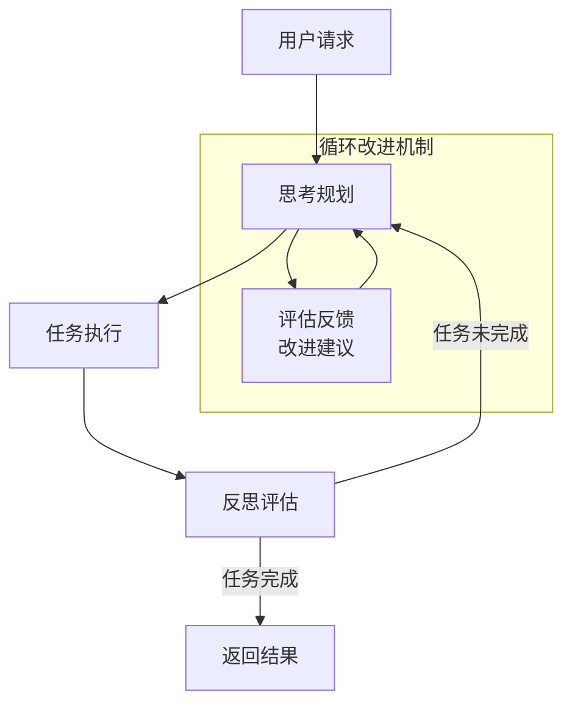

# 传统系统与循环反思型多智能体系统对比

## 传统RAG系统的工作流程

传统的检索增强生成（Retrieval Augmented Generation，RAG）系统通常遵循一个简单的线性工作流程：

1. **接收查询** - 用户提出问题或请求
2. **单次检索** - 系统执行一次性检索，找到相关文档
3. **合并上下文** - 将检索到的文档与用户查询合并为提示
4. **生成回答** - 大语言模型基于合并的上下文生成回答


## 循环反思型多智能体系统："想、做、回"模式

我们的循环反思型多智能体系统采用"想、做、回"三步工作模式，关键在于"回"阶段的自我评估和循环决策机制：

### 1. 【想】- 理解任务并规划执行

* **传统系统**：执行固定流程，无任务分析和自主规划
* **循环反思型系统**：
  * 理解用户需求本质
  * 将任务分解为可执行步骤
  * 制定执行策略
  * 预测可能的执行障碍

### 2. 【做】- 执行任务并收集结果

* **传统系统**：单一、固定的执行模式
* **循环反思型系统**：
  * 灵活选择适合任务的专业智能体
  * 多样化的执行能力（检索、代码、文件等）
  * 详细记录执行过程和中间结果
  * 处理执行过程中的异常情况

### 3. 【回】- 反思评估与循环决策（核心）

* **传统系统**：无自我评估，一次执行到底
* **循环反思型系统**：
  * **完成度评估**: 仔细检查结果是否满足原始需求
  * **差距分析**: 识别未完成的部分和不足之处
  * **循环决策**: 根据评估结果决定是否需要重新规划执行
  * **反馈传递**: 将反思结果作为反馈传入下一轮规划
  * **终止判断**: 在任务满足要求或达到最大循环次数时结束



## 两种系统在反思能力上的对比

| 能力维度 | 传统系统 | 循环反思型系统 |
|---------|--------|--------------|
| 自我评估 | ❌ 无评估能力 | ✅ 持续评估结果质量 |
| 识别不足 | ❌ 无法识别执行不足 | ✅ 主动识别结果缺失和错误 |
| 自我修正 | ❌ 无法修正错误 | ✅ 根据反思结果调整执行策略 |
| 迭代改进 | ❌ 一次执行到底 | ✅ 多轮循环持续改进 |
| 反馈利用 | ❌ 无反馈机制 | ✅ 将反思结果用于改进下轮规划 |
| 终止判断 | ❌ 固定流程 | ✅ 智能判断任务是否完成 |

## 循环执行机制的技术实现对比

| 技术方面 | 传统系统 | 循环反思型系统 |
|---------|--------|--------------|
| 状态传递 | 简单状态或无状态 | 完整状态传递，包括执行历史和反馈 |
| 循环控制 | 不支持循环 | 基于反思结果的动态循环控制 |
| 终止条件 | 流程结束即终止 | 完成度评估+最大循环次数保护 |
| 智能体协作 | 单一智能体或简单串行 | 基于评估结果的智能体动态调度 |
| 反馈机制 | 无 | 结构化反馈，指导后续规划 |

## 应用场景对比

| 场景 | 传统系统 | 循环反思型系统 |
|------|--------|--------------|
| 简单查询 | ✅ 足够高效 | ⚠️ 可能过度复杂 |
| 复杂问答 | ⚠️ 一次性回答，可能不完整 | ✅ 逐步完善，直至满足需求 |
| 任务执行 | ❌ 无法应对复杂任务 | ✅ 逐步分解和循环改进 |
| 处理反馈 | ❌ 无法响应执行不满意的反馈 | ✅ 可以根据反馈重新规划执行 |
| 复杂推理 | ❌ 一次性推理，易出错 | ✅ 通过多轮反思修正推理错误 |
| 创意生成 | ⚠️ 结果质量参差不齐 | ✅ 通过反思不断完善创意 |

## 反思驱动的循环执行示例

以下是循环反思型系统处理复杂任务的示例流程：

```
用户请求: "分析近10年全球AI创业公司融资趋势，并提供未来5年预测"

【第1轮】
- 思考：拆分为数据收集、趋势分析、预测模型三个子任务
- 执行：收集了部分数据，但缺乏系统性和完整性
- 反思：数据不全面，缺乏按地域和细分领域的分类 (STATUS: INCOMPLETE)

【第2轮】
- 思考：调整数据收集策略，按地域和领域分类
- 执行：收集更全面的数据，但分析粗浅
- 反思：数据较完整，但趋势分析不够深入，缺乏统计支持 (STATUS: INCOMPLETE)

【第3轮】
- 思考：基于已有数据，加强定量分析
- 执行：完成深入趋势分析，但预测部分欠缺
- 反思：趋势分析充分，但预测模型需要更多因素考量 (STATUS: INCOMPLETE)

【第4轮】
- 思考：完善预测模型，考虑市场、技术、政策多因素
- 执行：构建多因素预测模型，生成未来5年预测
- 反思：任务需求已全部满足，结果完整可靠 (STATUS: COMPLETE)

最终输出：完整的分析报告，包含全面数据、深入趋势分析和基于多因素的预测
```

## 循环反思系统面临的挑战

1. **评估标准难题**
   - 如何精确判断任务是否"完成"
   - 多维度评估指标的权衡

2. **无限循环风险**
   - 追求完美导致的过度循环
   - 最大循环次数的合理设置

3. **状态管理复杂性**
   - 每轮循环的状态传递与保存
   - 避免状态膨胀和污染

4. **反馈利用效率**
   - 如何充分利用反思结果改进下轮规划
   - 防止反馈噪音导致的方向偏离

5. **资源消耗与效益平衡**
   - 多轮循环带来的计算和时间成本
   - 边际效益递减问题

## 实现建议

1. **明确评估标准**
   - 为每类任务定义清晰的完成标准
   - 开发可量化的评估指标

2. **优化反思算法**
   - 提高反思的准确性和效率
   - 减少不必要的循环

3. **智能循环控制**
   - 动态调整循环策略
   - 基于边际改进决定是否继续

4. **轻量级状态管理**
   - 仅保留必要状态信息
   - 使用增量更新减少传递开销

5. **用户参与机制**
   - 在关键节点允许用户参与决策
   - 结合人机协作提高系统效率 